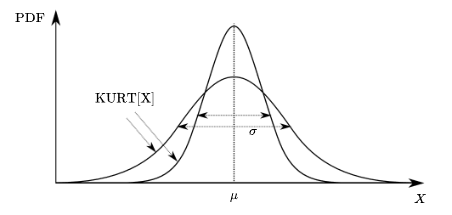
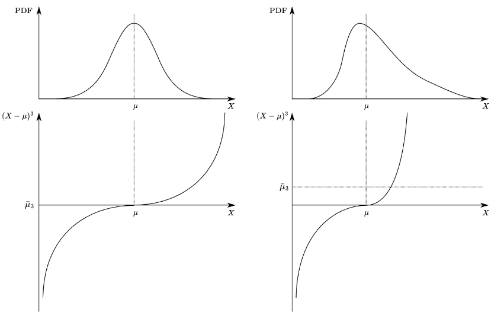

# 1. Statistics basics

This document will have basic equations needed to derive statistical concepts.

## **1.1 Basics of probability**

Probability constitutes the basics of statistics. Probability theory is an application of measure theory and relies on set theory. 

### **1.1.1 Axioms of probability**

Probability is about possible worlds and probabilistic assertions of how probable worlds are. **Sample space** is the set of all possible worlds. Possible worlds are *mutually exclusive* and *exhaustive*. A **random variables** is a measurement function that maps observations from a sample space to a measurable space, usually the real numbers $\mathbb{R}$. 

In the case of a random variable, for a fully specified **probability model** we can define a probability $P(A)$ for each possible outcome. 

While probabilities are an application of measurement theory, understanding probabilities does not require deep understanding of measurement theory itself. For completeness we include the formal definition as: let $(\Omega, F, P)$ be a measure space, called probability space for event $A$, sample space $\Omega$, event space $F$ and probability measure $P$. 

Probability can be described with a set of axioms named **Kolmogorov** axioms. 

Probability of each world can be defined as

$$P(A) \in \mathbb{R}, \\ 
\forall A \in F,\ \ 0 \le P(A) \tag{Axiom 1}$$

The total probability of all possible worlds is $1$

$$ P(\Omega) = 1 \tag{Axiom 2}$$

Set of worlds are called **events** or **propositions**. Probability of an event is the sum of the probability of the worlds which it contains. Formally it's the assumption of $\sigma$-additivity. For any countable sequence of disjoint sets $E_1...E_k$

$$ P(E_1 \cup ... \cup E_k) = P(E_1) + ... + P(E_k) \tag{Axiom 3} $$

### **1.1.2 Rules derived from axioms**

We can derive several consequences from the axioms

**Probability of empty set**

$$P(\phi) = 0$$

Proof

$E := \phi$ 
$E \cup \phi = E$ 
$P(E) + P(\phi) = P(E)$ 
$P(\phi) = P(E) - P(E)$ 
$P(\phi) = 0$

**Monotonicity**

$$A \subseteq B \implies P(A) \le P(B) $$

Proof

$A \subseteq B$ 
$A \cup (B \setminus A) = B$ 
$P(A) + P(B \setminus A) = P(B)$ 
$P(A) \le P(B)$

**Complement rule**

$$ A^C = \Omega \setminus A \implies P(A^C) = 1 - P(A) $$

Proof

$A$ and $A^C$ are mutually exclusive and $A \cup A^C = \Omega$

$P(A \cup A^C) = P(A) + P(A^C)$ 
$P(A) + P(A^C) = P(\Omega) = 1$ 
$P(A^C) = 1 - P(A)$

**Numeric bound**

$$P(A) \le 1 \text{, for all A in event space}$$

Proof from the complement rule

$P(A^C) = 1 - P(A)$ 
$P(A^C) \ge 0$, from the first axiom

**Inclusion-exclusion principle**

$$P(A \cup B) = P(A) + P(B) - P(A \cap B)$$

Proof

$A$ and $B \setminus A$ are mutually exclusive

$P(A \cup B) = P(A \cup (B \setminus A))$ 
$P(A \cup B) = P(A) + P(B \setminus A)$

Also $B \setminus A$ and $A \cap B$ are also exclusive with union B:

$(B \setminus A) \cup (A \cap B) = B$ 
$P(B \setminus A) + P(A \cap B) = P(B)$

Adding both sides of the two results together

$P(A \cup B) + P(A \cap B) + P(B \setminus A) = P(A) + P(B) + P(B \setminus A)$, we can eliminate $P(B \setminus A)$

$P(A \cup B) + P(A \cap B) = P(A) + P(B)$ 
$P(A \cup B) = P(A) + P(B) - P(A \cap B)$

### **1.1.3 Conditional probabilities**

Probability of a propositions in the absence of any other information or **condition** is called an **unconditional probability**, **prior probability** or **prior**. In many cases there is already some **evidence**, in which case we can calculate the **conditional** or **posterior** probability. For propositions $A$ and $B$ conditional probabilities are defined as:

$$ P(A|B) = {P(A \cap B) \over P(B)} $$

which holds for $P(B) > 0$. We can also write this as the **product rule** or **chain rule**

$$ P(A \cap B) = P(A|B)P(B) $$

**Conditional probabilities act the same way as priors, because they satisfy the three axioms of probability**

1. $P(A|B) \ge 0$ 
2. $P(B|B) = 1$ 
3.  if $A_1, A_2, ..., A_k$ are mutually exclusive events, then 
$P(A_1 \cup ... \cup A_k | B) = P(A_1|B) + ... + P(A_k|B)$

Proof

1. $P(A \cap B) \ge 0, P(B) > 0 \implies {P(A \cap B) \over P(B)} \ge 0$ 
2. $B \cap B = B$ 
$P(B \cap B) = P(B)$ 
$P(B|B) = {P(B \cap B) \over P(B)} = {P(B) \over P(B)} = 1$ 
3. From set theory, for: $A_1...A_k$ mutually exclusive sets 
$(A_1 \cup ... \cup A_k) \cap B = (A_1 \cap B) \cup ... \cup (A_k \cap B)$ 
$P((A_1 \cup ... \cup A_k) \cap B) = P((A_1 \cap B) \cup ... \cup (A_k \cap B))$ 
$P((A_1 \cup ... \cup A_k) \cap B) = P(A_1 \cap B) + ... + P(A_k \cap B)$ 
${P((A_1 \cup ... \cup A_k) \cap B) \over P(B)} = {P(A_1 \cap B) \over P(B)} + ... + {P(A_k \cap B) \over P(B)}$ 
$P(A_1 \cup ... \cup A_k | B) = P(A_1 | B) + ... + P(A_k | B)$

### **1.1.4 Bayes rule**

The Bayes rule can be used to change the cause-effect probability to effect-cause or the other way around. $P(\text{effect}|\text{cause})$ is the **casual** direction and $P(\text{cause}|\text{effect})$ is called the **diagnostic** direction

$$P(B | A) = {P(A | B) P(B) \over P(A)}$$

Proof using the product rule

$P(A \cap B) = P(A | B) P(B)$ and 
$P(A \cap B) = P(B | A) P(A)$ by making right side equal 
$P(B | A) P(A) = P(A | B) P(B)$ 
$P(B | A) = {P(A | B) P(B) \over P(A)}$

Bayes rule can be conditioned on a background variable

$$P(B | A, e) = {P(A | B, e) P(B, e) \over P(A, e)}$$

instead of calculating $P(A, e)$ we can sometimes calculate the complement instead and normalizing it to become $1$

$$\text{using notation }\boldsymbol{P}(A) := \langle P(A), P(A^C) \rangle \\  
\boldsymbol{P}(B|A) = \alpha\boldsymbol{P}(B|A)\boldsymbol{P}(A) \\ = \alpha \langle P(B|A)P(A), P(B|A^C)P(A^C) \rangle $$

where $\alpha$ is the normalization constant to make entries in $\boldsymbol{P}$  sum up to $1$

### **1.1.5 Interpretation of probability**

There are two main interpretation of probabilities:
* The **Bayesian interpretation** states that probabilities are degrees of beliefs of certain events. As new evidence is discovered, we can update our beliefs on the probability for an outcome.
* The **frequentist interpretation** states that probabilities are the ratio for a certain outcome to all outcomes for a long running process.

An interesting challenge for the bayesian interpretation is what if an agent does not assume the correct belief despite evidence. A counter argument is if probabilities would have a stake in a fair game, the agent who does update their belief system correctly, would more likely emerge as a winner against the agent that does not, hanse motivating agents to maximize having the correct belief system.

The two interpretations are mathematically equivalent, rely on the same set of axioms and definitions, including conditional probabilities. The bayesian interpretation of conditional probabilities is updating our belief system with some evidence while the frequentist interpretation is including new evidence to the evaluation of the repeated process. 

## **1.2 Describing random variables** ##
If we enumerate all possible outcomes and their probabilities, we can construct a function that describes a random variable. This function is called **probability distribution**. 

### **1.2.1 Discrete probability distribution** ###

If the random variable outcome is discreet like a coin toss, the probability distribution function is also called **probability mass function**. 

$$p: \mathbb{R} \to [0, 1], \  p_X(x) = P(X = x)$$

Where values must be non negative and sum up to one as per the Kolmogorov axioms

$$p_X(x) \ge 0$$
and
$$\sum_x p_X(x) = 1$$

### **1.2.2 Continuous probability distribution** ###

In the case of a continuous random variable, the probability distribution is also called the **probability density function (PDF)**. 

Since the random variable is continuous, the probability for the random variable to take a specific value is $0$. Instead we can describe the probability of a random variable taking a value from an interval 

$$Pr[a \le X \le b] = \int_a^bf(x)dx$$

Unlike the probability, the density function can take up values bigger than $1$, but the integrate on the complete domain needs to be $1$

$$\int_{-\infty}^\infty f(x)dx = 1$$

### **1.2.3 Cumulative distribution function** ###

An alternative description with a function of a random variable is the **cumulative distribution function** (CDF) which in both discrete and continuous case is defined as the probability of the random variable taking a value bigger or equal to $x$.

$$F_X(x) = p(X <= x)$$

It has the following properties

$$\lim_{x \to - \infty} F(x) = 0\text{ and }\lim_{x \to  \infty} F(x) = 1$$

$$P(a < X <= b) = F_X(b) - F_X(a)$$

For discrete distribution the CDF is

$$F_X(x) = \sum_{k <= x} p(k)$$

For a continuous random variable

$$F_X(x) = \int_{-\infty}^x p(y)dy$$

## **1.3 Properties of probability distributions, populations and samples**

The purpose of statistics is to estimate properties of a population, given a sample. Properties of a population are for example what we call the moments of a random variable, defined as

1st moment: mean or expectation as central tendency 
2nd moment: variance 
3rd moment: skewness 
4th moment: kurtosis 

We can define each in terms of a population, a sample, discreet probability distribution or continuous probability distribution. 

### **1.3.1 Mean or expectation**

The mean of a distribution is a method to measure the central tendency.

For a population size N, the mean is defined as

$$\mu = {\sum x \over N}$$

FOr a sample size $n$
    
$$\bar x = {\sum x \over n}$$

Discreet probability distribution

$$E[x] = \mu = \sum x p(x)$$

Continuous probability distribution

$$E[x] = \mu = \int_{-\infty}^\infty x f(x) dx$$

Other methods to measure the central tendency are

* **Median**: is the middle value, if we order all values, the median is the value in the middle of the row. If the number of values are even, the median is the mean of the middle two values. The benefit of median is that it:s not sensible for outliers. The drawback is that in many cases it:s difficult to calculate or to estimate.
* **Mode**: is the most frequently occurring value, or maximum of the probability mass function. A distribution can have multiple values as modes, for example, the uniform distribution will have all of it's values as the mode. If the probability mass function has multiple maximum the distribution is called multimodal. If there are two modes, the distribution is called bimodal. If the modes are not equal, i.e the probability mass function has a global maximum and local maxima, the global is the major mode, the local one is called minor mode.

### **1.3.2 Variance**

Population size N

$$\sigma^2={\sum(x-\mu)^2 \over N}$$

Sample size $n$, for variance degrees of freedom is $n-1$ (for single observation variance is undefined)

$$s^2={\sum(x-\bar x)^2 \over n-1}$$

For probability distributions

$$\sigma^2 = Var(X) = E[(X - E(X))^2]$$

It can be shown that

$$E[(X - E(X))^2] = E[X^2] - (E[X])^2$$

Proof with both discrete and continuous random variables:
https://proofwiki.org/wiki/Variance_as_Expectation_of_Square_minus_Square_of_Expectation

$\sigma$ is called the standard deviation and is the square root of variance. For a probability distribution it's noted with $\operatorname{SD}(X)$

### **1.3.3 Kurtosis**

The fourth standardized moment is called the **kurtosis** which measures the impact of extreme points.

$$\operatorname{KURT}[X] = E\left[ \left( X - \mu \over \sigma \right)^4 \right] = {\mu_4 \over \sigma ^ 4}$$

In case of distributions which are restricted in the area, like probability distributions have an area under the PDF curve as 1, a higher kurtosis would also mean increased variance and decreased mode or peak (see Figure 1.1). Despite this, kurtosis does not measure the peakness of distribution, rather the fatness of the tails of the distribution.

 <b>Figure 1.1: </b>Variance and kurtosis 

### **1.3.4 Skewness**

The third moment of statistics describes the symmetry of a distribution. 

$$\bar \mu_3 = E\left[ \left( X - \mu \over \sigma \right)^3 \right] = {\mu_3 \over \sigma ^ 3}$$

Where $\mu_3$ is the third central moment and $\bar \mu_3$ is skewness or the third standardized central moment Positively skewed is called right skewed, because the long tail is on the right side. Similarly negatively skewed is left skewed.

 <b>Figure 1.2: </b>Skewness

To understand how the third power measures skewness, Figure 1.2 shows the third power of the normalized PDF. Values of $X$ which are less than the mean is similar, but a right skewed distribution will have more points larger than the mean, the third power will grow faster, and the expectation of the third power will become positive.

Another method to measure skewness is using median and mode difference. Right skewed distribution will have mode smaller than the mean.

## **1.4 Multiple random variables** ##

We sometimes want to work with multiple random variables. 

### **1.4.1 Joint probability distribution** ###

The joint probability of two variables is noted by

$$P(A, B) = P(A \cap B)$$

The joint probability distribution is

$$f(x, y) = P(X = x, Y= y)$$

We can write it in terms of conditional distribution

$$P(X,Y) = P(X|Y)P(Y) = P(Y|X)P(X)\\
f(x, y) = P(X = x | Y= y) \cdot P(Y= y) = P(Y = y | X = x) \cdot P(X = x)$$

We can calculate the individual probability distributions from the joint probability distribution, and it's called the **marginal probability distributions** (if we enumerate a discreet joint probability distribution in a table, we would calculate the marginal distribution by summing up the rows and columns, making it the margin of the table as the last row and columns)

$$f_X(x) = \int f_{X,Y}(x,y)dy \\ f_Y(y) = \int f_{X,Y}(x,y)dx$$

Similarly to the probability distribution the joint cumulative distribution function

$$F_{X,Y}(x,y) = P(X \le x, Y \le y)$$

### **1.4.2 Independent and identically distributed random variables (i.i.d)** ###

Two variables are **independent** when the conditional probability is same as the pior

$$P(A|B) = P(A)$$

The joint probability distribution for two independent variables becomes

$$P(A,B) = P(A)P(B)$$

Independence can be stated with cumulative distribution functions

$$F_{X,Y}(x,y) = F_X(x)F_Y(y)\tag{i}$$

Two variables are **identically distributed** if their joint cumulative distribution function is equal

$$F_X(x) = F_Y(y)\tag{i.d}$$

Two variables are said to be **independent and identically distributed (i.i.d)** if both condition for independence (eq. (i)) and identically distributed (eq. (i.d.)) are both satisfied.

### **1.4.3 Covariance and correlation** ###

Similarity between two variables can be defined using correlation or covariance. 

For a random sample covariance is defined as

$$\operatorname{Cov}(x,y) = \sigma_{xy} = {\sum(x - \bar x)(y - \bar y) \over n-1}$$

If X and Y have a relationship where Y grows when X does, the covariance will be positive. If Y has an opposite relationship, e.g. decreases as X increases, the Covariance is negative. If X and Y are independent, the Covariance is $0$. Note that the opposite is not true, there might be a complex, non independent relationship between X and Y which would result in 0 Covariance.

For a discreet probability distribution covariance is

$$\operatorname{Cov}(X, Y) = \sum(X - E[X])(Y - E[Y])P(X,Y)$$

**Correlation** is defined as

$$\operatorname{Corr}(x,y) = {\sigma_{xy} \over \sigma_x \sigma_y}$$

Covariance can take up large values, while correlation is the normalized version of covariance, taking up values between $-1$ and $+1$ with the same meaning.

For a discreet probability distribution correlation is

$$\operatorname{Corr}(X, Y) = {\operatorname{Cov}(X, Y) \over \operatorname{SD}(X)\operatorname{SD}(Y)}$$

### **1.4.4 Properties of expectation and variance**

Multiplying by a constant the expectation of a random variable gives

$$E[aX] = \int_{-\infty}^{\infty}aXf_XdX = aE[X] = a \mu_X$$

Similarly for variance, using the result we just got

$$Var(aX) = E[(aX - E(aX))^2] = E[(aX - aE(X))^2] = a^2 Var(X)$$

What these results show is that multiplying the random variable with a factor of $a$, the mean will be scaled with same factor $a$, but variance will be scaled with $a^2$ because variance describes squared distance from the mean. 

From the summation and integral properties we can easily show that the mean of a linear combination of two variables is a linear operation:

$$E[aX + bY] = aE[X] + bE[Y]$$

The variance of a linear combination is 

$$Var(aX + bY) = a^2 Var(X) + b^2 Var(Y) + 2ab\operatorname{Cov}(X, Y)$$

If $X$ and $Y$ are independent variables, the $\operatorname{Cov}$ term becomes $0$, and we get

$$Var(aX + bY) = a^2 Var(X) + b^2 Var(Y)$$

Proof:  
$Var(X) = E[(X - E[X])^2]$  
$=E[(aX + bY - E[aX + bY])^2]$  
$=E[(aX + bY - aE[X] - bE[Y])^2]$  
$=E[(aX - aE[X] + bY - bE[Y])^2]$  
$=E[(aX - aE[X])^2 + 2(aX - aE[X])(bY - bE[Y]) + (bY - bE[Y])^2]$ 
$=E[a^2(X - E[X])^2 + 2ab(X - E[X])(Y - E[Y]) + b^2(Y - E[Y])^2]$ 
$=E[a^2(X - E[X])^2] + E[2ab(X - E[X])(Y - E[Y])] + E[b^2(Y - E[Y])^2]$ 
Finally using definition of variance and covariance, we get 
$=a^2 Var(X) + 2ab \operatorname{Cov}(X, Y) + b^2 Var(Y)$