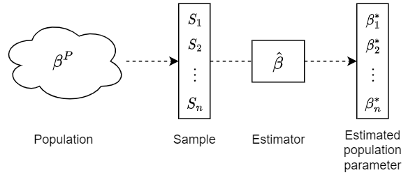
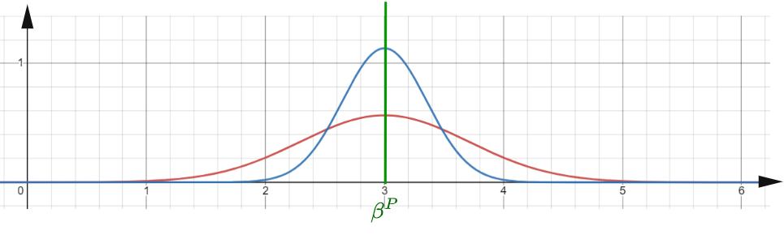
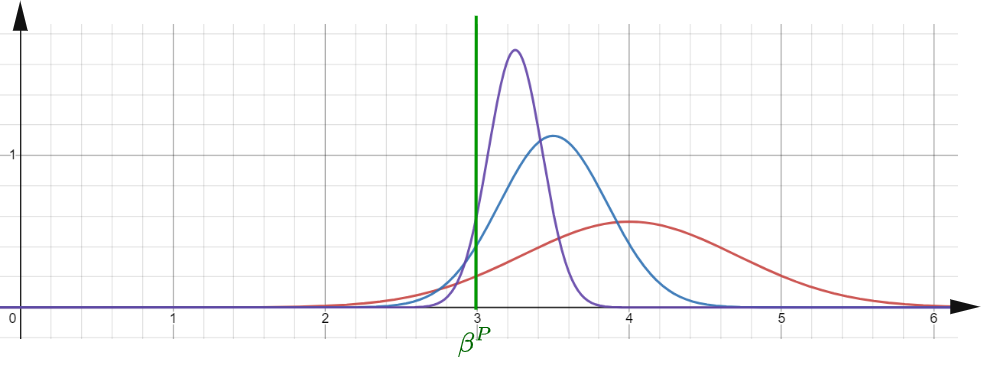

# 3. Machine Learning

In the world of data science there are two main views. From one side there is the mathematically well founded statistical methods like **statistical learning** which mainly focuses on explaining population data from a sample. Various linear models are well defined within statistics. **Machine learning** contains more complex techniques which might not have well founded probabilistic interpretations but provide good empirical results. There is major overlap and no easy way to differenciate the two view. We will start from statistical learning and move toward more complex machine learning models.

Statistical learning is a set of techniques where we try to fit a **model** to an observed data set. The model might also be called a **data generator process**. There are two main objectives why we would like to do this:
* **Inference** about population properties by calculating the model properties  
* **Forecast** values of the population outside of the available sample/observations.

The variable we would like to model or forecast is called the **independent** variable. The input variables used for modelling or forecast are called **dependent** variables. We can model an **independent** $Y$ variable with the **dependent** variables $X$ of a sample of observations. We assume the following relationship

$$Y = f(X) + \epsilon \tag{4.1}$$

We define estimated model in the form

$$\hat{Y} = \hat{f}(X) \tag{4.2}$$

$\epsilon$ is the error term and can be decomposed using the expected value of (4.1) and (4.2) to two terms, called the **reducible error** and the **irreducible error**:

$$E[(Y-\hat{Y})^2] = \underbrace{[f(X)-\hat{f}(X)]^2}_\text{Reducible error} + \underbrace{\text{Var}(\epsilon)}_\text{Irreducible error}$$

Proof:

Using (4.1) and (4.2) 
$E[(Y-\hat{Y})^2]=E[(f(X)+\epsilon-\hat{f}(X))^2]$ 
$=E[(f(X)-\hat{f}(X))^2+2 \epsilon (f(X)-\hat{f}(X)) +\epsilon^2]$

Because the expectation is linear operator 
$=E[(f(X)-\hat{f}(X))^2] +2E[\epsilon (f(X)-\hat{f}(X))] +E[\epsilon^2]$

Because the expectation of $f$ and $\hat{f}$ are constant 
$=[f(X)-\hat{f}(X)]^2 +E[\epsilon^2] +2E[\epsilon (f(X)-\hat{f}(X))$

Because the mean of $\epsilon$ is zero 
$=[f(X)-\hat{f}(X)]^2 +E[\epsilon^2]$

Because the variance of $\epsilon$ is $E(\epsilon^2)$ 
$=[f(X)-\hat{f}(X)]^2 + \text{Var}(\epsilon)$

We can opimize our estimate to minimize reducible error but irreducible error is also unknown and our model might overfit by including some fit on the noise to our estimate.

## **3.1 Estimators**

We fit a model to an observed dataset by estimating the model parameters. For this estimation process we can use a function called an **estimator**. Depending on the output of estimator we distibguish the following types of estimators:

* **Point estimator**: outputs a single value for a parameter. It is easy to interpret but might not give information on the variability or confidence.
* **Interval estimator**: outputs an interval providing insight to the confidence of the output.
* **Bayesian estimator**: outputs a probability distribution.

Given a population parameter $\beta_P$, an estimator function $\hat \beta$,and the samples $S_1, S_2, ..., S_n$, we can aplpy the estimator function to each sample. This would result in a set of estimated parameters $\beta^*_1, \beta^*_2, ..., \beta^*_n$

 <b>Figure 3.1: </b>Applying estimator to a set of observations 

Since the samples might not be fully representative of the population, the estimated parameters might also have some error to the real parameter $\beta^P$. 

 <b>Figure 3.2: </b><i>Plot of the probability distribution for the estimates which we get by applying an unboased and consistent estimator to each sample. The red distribution is for a smaller sample with higer variance, the blue one is less variance measured on higher sample.</i>

We can define the following characteristics of an estimator

1. **Unbiased**: The expectation (mean) of the estimator matches the population parameter it estimates (see **Figure 3.2** where the mean of the distribution is equal to the true population parameter)

$$E[\hat \beta] = \beta^P$$

2. **Consistent**: As the sample size grows, the estimator tends to the true value of the parameter (see **Figure 3.2** where the red line is a small sample, the blue line is a larger sample and the green line would be an infinitely large sample or the entire population)

$$n \to +\infty: \hat \beta \to \beta^P $$

 <b>Figure 3.3: </b><i>Biased consistent estimator.</i>

**Figure 3.3** shows a biased but consistent estimator. For small sample sizes there is a bias between the true parameter and the mean of estimated parameters, but as the sample size increases, the distribution tends toward the true parameter.

3. **Efficiency**: given two estimators $\hat \beta$ and $\widetilde \beta$, the estimator $\widetilde \beta$ is said to be more efficient if it has lower variance using the same sample size. An efficient estimator might be biased. An example would be in **Figure 3.2** if it were two different estimtors with same sample size, one of them giving a more accurate distribution.

4. **Linear in parameters** might be preferable so it can be mathematically easily manipulated.

A specific case are the so called **BLUE estimators** which stands for **best linear unbiased estimators**, meaning there is no better linear estimator available.

## **3.2 Model fitting**

There are two main probabilistic optimization frameworks to estimate model parameters or **weights**, given a set of observations: **Maximum Likelihood Estimation** (MLE) and **Maximum a Posteriori** (MAP). The difference is that MAP assumes a prior probability distribution and tries to estimate parameters using the posterior probability, MLE estimates parameters using the prior based on observations only.

$$\theta_{MLE} = argmax_{\theta}\ f_n(x_1...x_n|\theta)$$

If values of $x_1...x_n$ are i.i.d or we assume it, becomes

$$\theta_{MLE} = argmax_{\theta}\ \prod_{i=1}^nf(x_i|\theta)$$

We than try to optimize $L(\theta)$. Since it's an optimization problem, we can optimize log likelyhood of $log\ L(\theta)$ instead to facilitate derivative calculations and avoid underflows due to several products of small decimal values.

If we assume a prior distribution in addition to our observations, we can apply MAP, which maximizes the posterior function :

$$
\begin{aligned}
\theta_{MAP} &= argmax_{\theta}\ f(\theta|x_1...x_n) \\
&= argmax_{\theta}\ g(\theta) f(x_1...x_n|\theta)
\end{aligned}
$$

We skipped the denuminator (so-called marginal likelihood) after applying the Bayes rule above because it does not change the optimization problem.

For example for linear regression, MLE estimates the mean squared loss, applying MAP will estimate L2 regularization as well.

There are two main methods of model fitting
* If there is closed solution for the optimization we can apply analytical calcuation. This is only possible in few cases, for simple models with few parameters
* Iterative approach: a more commonly used approach, which can fit very complex models

## **3.3 Cost function and bias-variance trade-off**

To measure how well the model fits our observed data we can use a **cost function**. For a function to be considered as a cost function, it needs to fulfill the following attributes

* Should always be positive
* If our estimate improves, the cost function should decrease

Using the likelyhood function, which is the probability we can observe our data given our model, we can transform it to be a positive function, which decreases the better the fit. This is called the **negative log likelyhood cost function**. Given a set of observations $X$ and a statisticam model with parameters $\theta$ and the likelyhood function $L(\theta | X)$, the cost function is:

$$\operatorname{NLL} = - \ln(L(\theta | X))$$

The likelyhood function is mainly used to estimate parameters of proability distribution given the observed data, but might not have closed form or might have more than one local minima which is why other cost functions which are easier to optimize might be used to fit machine learning models.

A popular example of a cost function is the *mean squared error* or MSE, which is the averagee of the squared difference of predicted and actual output for each observation $i$.

$$\operatorname{MSE} = {1 \over n} \sum_{i=1}^n(y_i - \hat{f}(x_i))^2 $$

The MSE of an estimator $\hat{\theta}$ with respect to an unknown parameter $\theta$ is defined as

$$\operatorname{MSE}(\hat\theta)=E_\theta[ ({\hat \theta}-\theta )^{2} ]$$

MSE can be decomposed to a combination of bias and variance of the estimator

$${\displaystyle \operatorname {MSE} ({\hat \theta})=\operatorname {Var} _\theta({\hat \theta})+\operatorname {Bias} ({\hat \theta},\theta )^{2}}$$

Proof

Using the definition of variance

$\operatorname{Var}(X) = E(X^{2}) - (E(X))^{2}$  
$E(X^{2})=\operatorname{Var}(X)+(E(X))^{2}$ 

By substituting $X$ with $\hat {\theta }-\theta$ it can be shown that

$\operatorname{MSE} ({\hat {\theta }})=\mathbb {E} [({\hat {\theta }}-\theta )^{2}]$ 
$=\operatorname {Var} ({\hat {\theta }}-\theta )+(\mathbb {E} [{\hat {\theta }}-\theta ])^{2}$ 
$=\operatorname {Var} ({\hat {\theta }})+\operatorname {Bias} ^{2}({\hat {\theta }})$

Variance is always positive and bias is squared. The selected estimator needs to minimize both variance and bias in order to minimize $\operatorname{MSE}$

We can scale MSE to be the same size as our data, this metric is called **Root Mean Sqaure Error** or RMSE

$$\operatorname{RMSE} = \sqrt{\operatorname{MSE}}$$

## **3.4 Regularization**

## **3.5 Model choice**

When we would like to fit a model to the data we first assume a model structure, this process is called **model choise** e.g. a linear model, tree model, nerual network, etc. We then try to estimatee the model parameters. There are two main parameters:
* **Hyperparameters**: describe the structure of model or model fitting, e.g. learning rate, layers in a neural network, the K in KNN, etc
* **Weights** or **parameters**: are function parameters we can adjusted during the learning process to best fit the model to the observed data given the regularization.

Finding the right hyperparameters and estimating weights have different techniques.

## **3.5 Model validation**

Cross validation

## **3.6 Hyper parameter tuning**
