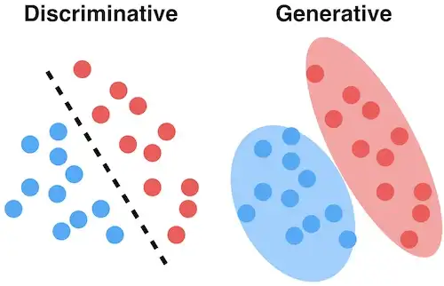
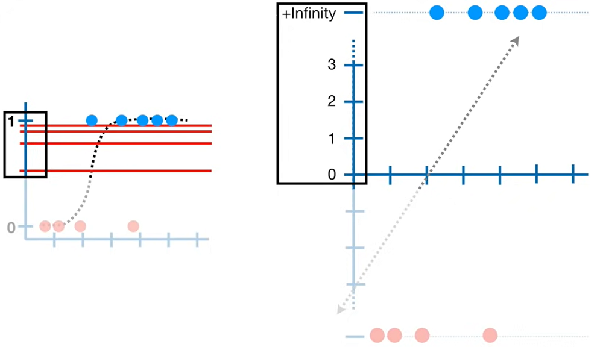

# 4. Classifiers

Classification is the problem of mapping variables to a categorical dependent variable. While in some cases there can be more than two categories, we can reduce the problem of classifing to a category or another and repeating for the latter. 

We can measure performance of classifier trough the error rate

$${1 \over n} \sum_{i=1}^nI(y_i \ne \hat y_i)$$

where $\hat y$ is predicted class for $i$ th observation and $I(y_i \ne \hat y_i)$ is an indicator having value of $0$ in case of missclassification and $1$ for correct classification.

The test error rate is minimized by maximizing the **Bayes classifier**, which assigns each observation to the most likely class, given it's predictor values

$$argmax_j(Pr(Y = j | X = x_0))$$

We use $argmax$, because we need the max $j$ parameter and not maximum probability.

Prediction of the Bayes classifier is determined by the so called **Bayesian decision boundary** where probability is $0.5$. The Bayes classifier produces the lowest error rate called **Bayes error rate**

$$1 - E(max_j(Pr(Y = j | X)))$$

The Bayes error rate is analogous to the irreducible error of linear models. The Bayes classifier in most cases is unknown and we would like to estimate it.

Proofs:
https://en.wikipedia.org/wiki/Bayes_classifier

Same as regression there are two main categories of classification: non parametric like KNN and parametric classificaiton.

Parametric classifications can be further categorized based on the parameter estimation approach (see also **Figure 4.1**): 
* **Discriminative classifier**: we estimate probability of an observation to belonging to a particular value of categorical variable $Y$, drawing a separation boundary. Example: logistic regression.
* **Generative classifier** we estimate distribution of each class of $Y$ separately based on observations and using all estimates of an observation, we choose the maximum to decide final class. Examples:
  * Naive Bayes
  * Linear discriminant analysis (LDA), a dimensionality reduction technique
  * Quadratic discriminant analysis
  * Hidden Markov Model 

 <b>Figure 4.1: </b><i>Discriminative vs generative classifier</i> (source dataisutopia.com)

## **4.1 K nearest neighbour classifier (KNN)**

KNN classifier tries to estimate the Bayes classifier, by finding the K neaerest observation in training data closest to $x_0$ test observation

$$Pr(Y = j | X = x_0) = {1 \over K} \sum_{i \in N_0}I(y_j = j)$$

The classifier result will be the max probability: $argmax_j(Pr)$

$$C^{KNN}(x) = argmax_j({1 \over K} \sum_{i \in N_0}I(y_j = j))$$

Small K values lead to higher variance, $K=1$ will perfectly fit the training data.

## **4.2 Logistic regression**

In logistic regression we model the probability of an observation belonging to one of two classes with logistic function. \output ranges between 0 and 1 (<b>Figure 4.2</b> left side)

$$P(X) = {e^{\beta_0 + \beta_1X_1 + ... +  \beta_pX_p} \over 1 + e^{\beta_0 + \beta_1X_1 + ... + \beta_pX_p}}$$

We can transform the above to odds form $p \over 1-p$

$P(X) = {e^z \over 1 + e^z}$ 
$P(X)\cdot(1 + e^z) = e^z$ 
$P(X) + P(X) e^z = e^z$ 
$P(X) = e^z(1-P(X))$ 
${P(X) \over 1 - P(X)} = e^z$

Giving

$${P(X) \over 1 - P(X)} = e^{\beta_0 + \beta_1X_1 + ... + \beta_pX_p}$$

Taking $log$ of both sides gives the log odds or **logit**

$$log\bigg({P(X) \over 1 - P(X)}\bigg) = \beta_0 + \beta_1X_1 + ... + \beta_pX_p$$

Which is a linear function, see right side of **Figue 4.2**

 <b>Figure 4.2: </b><i>Left side probability p, rights side logit transformation. Observations move from 0 to negative infinity and from 1 to infinity</i> (source StatQuest)

We can use categorical variables trough dummies, same as linear regression.

### **4.2.1 Fitting the model**

The logistic function can be fit using maximum likelyhood. The lokelyhood function is

$$\ell(\beta_0, \beta_1) = \prod_{i:y_i=1}p(x_i)\prod_{j:y_j=1}\big (1 - p(x_j)\big )$$

### **4.2.2 Multinomail logistic regressoin**

Multinomial logistic regression is used to classify more than two classes. To achieve this we use a reference class and coefficients tell the relative change of one class probability compared to another. 

Model for classifying multiple classes when using the $K$ th class as reference for classes $k = 1...K-1$

$$Pr(Y=k|X=x) = {e^{\beta_{k0} + \beta_{k1}X_1 + ... + \beta_{kp}X_p} \over 1 + \sum_{l=1}^{K-1}e^{\beta_{l0} + \beta_{l1}X_1 + ... + \beta_{lp}X_p}}$$

and for class $K$

$$Pr(Y=K|X=x) = {1 \over 1 + \sum_{l=1}^{K-1}e^{\beta_{l0} + \beta_{l1}X_1 + ... + \beta_{lp}X_p}}$$

we can derive

$$log\bigg({Pr(Y=k|X=x) \over Pr(Y=K|X=x)}\bigg)=\beta_{k0} + \beta_{k1}X_1 + ... + \beta_{kp}X_p$$

Proof (with simplified notations): 
$log\big({Pr(k) \over Pr(K)}\big) = log\bigg({{e^{z_k} \over 1 + \sum_{l=1}^{K-1}e^{z_l}} \over {1 \over 1 + \sum_{l=1}^{K-1}e^{z_l}}}\bigg) = log({e^{z_k} \over 1}) = log(e^{z_k}) = z_k$

An alternative is to use softmax encoding, we etimate coefficients for all classes $k = 1...K$

$$Pr(Y=k|X=x) = {e^{\beta_{k0} + \beta_{k1}X_1 + ... + \beta_{kp}X_p} \over \sum_{l=1}^K e^{\beta_{l0} + \beta_{l1}X_1 + ... + \beta_{lp}X_p}}$$

and we calculate ration between classes $k$ and $k'$

$$log\bigg({Pr(Y=k|X=x) \over Pr(Y=K|X=x)}\bigg)=(\beta_{k0}-\beta_{k'0}) + (\beta_{k1}-\beta_{k'1})X_1 + ... + (\beta_{kp}-\beta_{k'p})X_p$$

Proof (with simplified notations): 
$log\big({Pr(k) \over Pr(k')}\big) = log\big({e^{z_k} \over e^{z_{k'}}}\big) = log(e^{z_k}) - log(e^{z_{k'}}) = z_k - z_{k'}$

### 4.2.3 Assessing the model

Each estimated coefficient has associated *z*-statistic
$$\hat \beta_1 \over \operatorname{SE}(\hat \beta_1)$$

If *z*-statistic is large, and the associated $p$-value is below a selected $\alpha$ we can reject the null hypothesis: $H_0: \beta_1 = 0$

## **4.3 Generative Models for Classification**

Instead of directly estimating $Pr(Y = y|X = x)$ we estimate the distribution $Pr(X = x|Y=k)$ for each value $k$ of $Y$ and then we use Bayes rule to flip the conditional and calculate $Pr(Y = y|X = x)$. Whith this approach we can model the cases better, where $X$ is more separated for each valye of $Y$. 

If $Pr(Y = k)$, denoted with $\pi_k$ is the overall probability that an observation belongs to class $k$ (i.e $n_k \over n$ where $n_k$ is samples in class $k$ and $n$ is total number of samples of our training data) and $f_k(X) = Pr(X | Y = k)$ is the distribution of a single class, using Bayes rule we get

$$Pr(Y = k|X = x) = p_k(x) = {\pi_k f_k(x) \over \sum_{l=1}^K\pi_l f_l(x)}$$

### **4.3.1 Linear discriminant analysis**

### **4.3.2 Naive Bayes classifier**

$${\displaystyle C^{\text{Bayes}}(x)={\underset {y_i}{\operatorname {argmax} }}\operatorname {P} (Y=y_i)\prod _{j} P(X_j|Y=y_j)}$$

## **4.4 Evaluating classifiers**

<table>
  <tr>
    <td></td>
    <td></td>
    <th align="center" colspan="2">Predicted class</th>
    <td></td>
  </tr>
  <tr>
    <td></td>
    <td></td>
    <th align="center">Positive</th>
    <th align="center">Negative</th>
    <td></td>
  </tr>
  <tr>
    <th rowspan="2">Actual class</th>
    <th align="center">Positive</td>
    <td align="center">True Positive (TP)</td>
    <td align="center">False Negative (FN) Type II error</td>
    <td align="center"><b>Sensitivity</b> $$TP \over TP + FN$$</td>
  </tr>
  <tr>
    <th align="center">Negative</td>
    <td align="center">False Positive (FP) Type I error</td>
    <td align="center">True Negative (TN)</td>
    <td align="center"><b>Specificity</b> $$TN \over TN + FP$$</td>
  </tr>
</table>

## References

**An Introduction to Statistical Learning, with applications in R, Second Edition**, Gareth James, Daniela Witten, Trevor Hastie, Rob Tibshirani

https://betterprogramming.pub/generative-vs-discriminative-models-d26def8fd64a