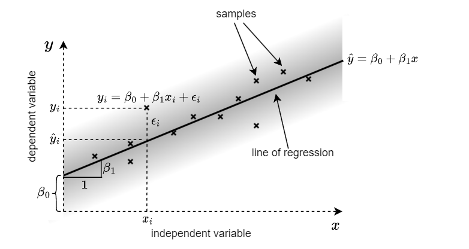
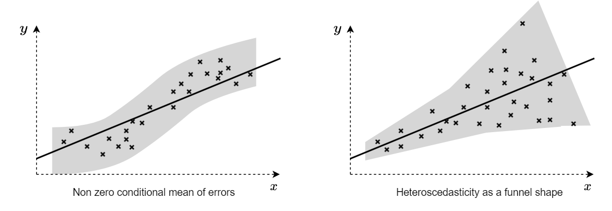

# 4 Regression

**Linear models** are a set of supervised statistical learning techniques, used to approximate an unknown function based on observations using a liner combination of predictors and weights. 

Linear regression tries to map continuous or categorical variables to a continuous independent variable. For $X_1...X_p$ predictor variables and $\epsilon$ irreducible error term, linear regression model has the form

$$y = \beta _0 + \beta _1 x_1 + ... + \beta _p x_p + \epsilon$$

The regression coefficients $\beta_1...\beta_p$ are unknown, an estimate takes the form

$$\hat y = \hat \beta _0 + \hat \beta _1 x_1 + ... +  \hat \beta _p x_p$$

$\epsilon$ is the error term. For a linear fit, the error term is assumed to be independent and identically distributed with mean 0 and constant variance: 

$$\epsilon \sim i.i.d(0, \sigma^2)$$

Independent means that the error of a sample does not give information about the error of an another sample. Identically distributed means errors come from the same distribution. For example the error does not depend of $x$.

 <b>Figure 4.1: </b>Linear regression with a single predictor, called simple linear regression. The gray shading represents the error distribution around the linear regression. 

## **4.1 Fitting the model**

Linear regression has a closed form solution so we can derive the best fit line analytically. Parameters can be estimated using our training data set and the sum of squared residual loss function

$$\operatorname{RSS} = \sum_{i=1}^n(y_i - \hat y)^2 = \sum_{i = 1}^n \hat\epsilon_i^2$$

As a matrix representation, we can write our linear regression as:

$$\begin{pmatrix} y_1 \\ y_2 \\ \vdots \\ y_n \end{pmatrix} = 
 \begin{pmatrix}
  x_{1,1} & x_{1,2} & \cdots & x_{1,p} \\
  x_{2,1} & x_{2,2} & \cdots & x_{2,p} \\
  \vdots  & \vdots  & \ddots & \vdots  \\
  x_{n,1} & x_{n,2} & \cdots & x_{n,p} 
 \end{pmatrix}
 \begin{pmatrix} \beta_1 \\ \beta_2 \\ \vdots \\ \beta_p \end{pmatrix} + \begin{pmatrix} \epsilon_1 \\ \epsilon_2 \\ \vdots \\ \epsilon_n \end{pmatrix}$$

Or simply as 

$$Y = X \beta + \epsilon$$

where $n$ is the number of samples, $p$ is the number of predictors, and $\epsilon$ is the error. We don't know the real weights and error term, so we use hat notation for estimates as

$$Y = X \hat\beta + \hat\epsilon \tag{4.1}$$

We can write $\operatorname{RSS}$ as 

$\operatorname{RSS} = \sum_{i = 1}^n \hat\epsilon_i^2 = \begin{pmatrix} \hat\epsilon_1 & \hat\epsilon_2 & \cdots & \hat\epsilon_n \end{pmatrix} \begin{pmatrix} \hat\epsilon_1 \\ \hat\epsilon_2 \\ \vdots \\ \hat\epsilon_n \end{pmatrix} = \hat\epsilon^T\hat\epsilon$  

From rearranging (4.1) and plugging in we get 
$\operatorname{RSS} = (Y-\hat\beta X)^T(Y-\hat\beta X)$

Because the transpose operator $A^T$ is a linear operator, we can apply to each item individually (we also need to change order of matrix multiplication):

$\operatorname{RSS} = (Y^T- X^T \hat\beta^T)(Y-\hat\beta X)$ 
$\operatorname{RSS} = Y^T Y - Y^T \hat\beta X - X^T \hat\beta^T Y + X^T \hat\beta^T \hat\beta X$

We would like choose $\hat\beta$ which minimizes $\operatorname{RSS}$, i.e: $argmin_{\hat\beta} \operatorname{RSS}$. For this we can calculate $\beta$ for which the derivate is $0$: 

${\partial \operatorname{RSS} \over \partial \hat\beta} = 0$ 
${\partial \over \partial \hat\beta}(Y^T Y - Y^T \hat\beta X - X^T \hat\beta^T Y + X^T \hat\beta^T \hat\beta X) = 0$ 

The first term is $0$, the second term is the transpose of the third. Notice that all terms results in a scalar, but the gradient results in a column vector, so result has to be the $0$ column vector, which we can notate as $O$.

$-X^T Y - X^T Y + 2 X^T X \hat\beta = O$ 
We can rearrange as  
$2 X^T X \hat\beta = 2X^T Y$ 
We can remove the $2$ and multiply both side by $(X^TX)^{-1}$, which cancels out on the left, resulting in

$$\hat\beta = (X^TX)^{-1} X^T Y$$

To be able to derive $\hat\beta$, the term $X^TX$ needs to be invertible, so it has to be non singular (determinant is non 0). An example for singular case is when there is perfect colliniarity between two or more predictors.

## **4.2 Assess quality of fit**

To assess quality of fit, the **residual standard error** $RSE$ is an estimate of standard deviation of $\epsilon$

$$\operatorname{RSE} = \sqrt{\operatorname{RSS} \over n - p - 1}$$

$RSE$ is on same scale as $y$, $R^2$ is another measure of fit on the scale between $0$ and $1$

$$
\begin{aligned}
R^2 &= {\operatorname{variance\ explained} \over \operatorname{total\ variance}} = {Var(\operatorname{mean}) - Var(\operatorname{fit}) \over Var(\operatorname{mean})}
\\
&= {{\operatorname{TSS} \over n} - {\operatorname{RSS} \over n} \over {\operatorname{TSS} \over n}} = {\operatorname{TSS} - \operatorname{RSS} \over \operatorname{TSS}} = 1 - {\operatorname{RSS} \over \operatorname{TSS}}
\end{aligned}
$$

where $TSS$ is **total sum of squares**: $TSS = \sum(y_i - \bar y)^2$. $\bar y$ is the average of $y$. $RSS$ is the amount of variability unexplained after regression, $TSS$ is the total variability. Some text books use this notation

$$R^2 = {SS(\operatorname{mean}) - SS(\operatorname{fit}) \over SS(\operatorname{mean})} $$

In simple liner regression setting ($y = \beta _0 + \beta _1 x$), $R^2$ is same as $Cor(X, Y)^2$

If we have $p+1$ observations $R^2$ will **always be $1$** because we are fitting a $p$ dimensional plane on $p+1$ points so there is always a perfect fit. Such a fit however has very little confidence. To calculate p-value for $R^2$ we use the $F$ value 

$$F = {\operatorname{variance\ explained} \over \operatorname{variance\ not\ explained}} = {SS(\operatorname{mean}) - SS(\operatorname{fit}) / (p_{\operatorname{fit}} - p_{\operatorname{mean}}) \over SS(\operatorname{fit}) / (n - p_{\operatorname{fit}})}$$

Where in case of linear regression $p_{\operatorname{mean}}$ is $1$

We can either simulate lots of F values by sampling our data, calculating the fitted line and F score and finally calculating the F score for the whole dataset and finding percentiles of more extreme values from our simulations, or we can use the *F*-distribution  

## **4.3 Categorical predictors**

Categorical predictors can be added trough dummy encoding. In this case the equation will be

$$y = \beta_0 + \sum_{c \in C}\beta_cx_c$$

Where $C$ contains all categorical values except one which will act as baseline (and be part of intercept). If all dummies are included, it will cause multi colliniarity because the last dummy explains the others.

## **4.4 Extensions to the linear model**

We can remove additive assumptions by creating custom predictors combining other predictors called **interactions** or adding **polynomial terms** . E.g.

$$y = \beta_0 + \beta_1x_1 + \beta_2x_2 + \beta_3x_1x_2 + \beta_4x_2^2 + \beta_5x_2^3$$

When we include interactions or polynomial terms we should always include the base predictors called **main effects**. Categorical variables only contribute to intercept, to add slope effect as well, needs to be added to interaction

## **4.5 Assumptions of linear regression**

The **Gauss-Markov theorem** proposed by two mathematicians says that ordinary least squares is the best linear unbiased estimator (BLUE) under the following assumptions:

1. **Linear in parameters**: coefficients of the predictors must be linear. For example $\beta_0 + \beta_1X_1 + \epsilon$ is linear but $\beta_0 + \beta_0\beta_1X_1 + \epsilon$ is not. Can be verified using residual plots ($e_i = y_i - \hat y_i$ vs $x_i$ or in the case of multiple regression $y_i$). In case of non linearity polynomial terms can be used, e.g $\beta_0 + \beta_1X_1 + \beta_2X_1^2$ and similar exponential terms are still linear in parameters.

2. **Random sampling**: our samples $\{x_i, y_i\}$ are randomly selected from a population. This assumption also contains the assumption that all samples come from the same population. 

3. **No perfect colliniarity** in regressors: there cannot be an exact relationship between regressors. **Multicolliniarity** happens if there is correlation between predictor variables. If two predictors are correlated, increasing the coefficient of one can be cancelled out by a corresponding opposite change of the other coefficient, thus making coefficients highly unstable (multiple values for coefficients result in same fit, including infinitely large coefficients). Pairwise correlation can be detected by plotting the correlation matrix of the predictors. Can be quantified trough the **variance inflation factor** (VIF) $$\operatorname{VIF}(\beta_j) = {1 \over 1 - R_{X_jX-j}^2}$$.

4. **Zero conditional mean** of error: $$E(\epsilon | X) = 0$$ means the expectation of the error term does not depend on the value of x. The error is uniformly distributed along the regression line (does not move above or below the line depending on the value of X). It's also called **exogeneity**, which means there is no hidden variable or relationship influencing the error term. If there is a relationship and violates this assumption, we say the regressor is influenced by or are **endogenous** to the error term (endogeneity).

5. **Constant variance of error terms** or **homoscedastic errors**: if error terms increase with dependent variable, it's called **heteroscedasticity** and can be seen on the residual plot as a funnel shape. In the case of this issue, we can transform the response using a concave function ($\sqrt{y}$ or $log(y)$). Another option might be to fit using **weighted least squares**. 

 <b>Figure 4.2: </b>Non zero conditional mean on left, error are below or above the line as X changes and heteroscedastic errors on the right. 

6. **Error terms are uncorrelated**, an error term $\epsilon_i$ provides no information about $\epsilon_j$, like sign or distance, which is the case for example for time series analysis. Mathematically this can be expressed as $$Cov(\epsilon_i, \epsilon_j) = 0 \implies i = j$$

## **4.6 Other considerations**

### **Outliers** 

**Outliers** can be identified from residual plot, or we can plot **studentized residuals** $$\bigg|{\epsilon_i \over SE}\bigg| > 3$$  
Outliers might indicate incorrect data input in which case can be simply removed or issues with model like missing predictor variable

### **High leverage points** 

**High leverage points**  are observations which have unusual predictor $x_i$ values and might easily influence the regression. A so called **leverage statistic** can be calculated to quantify leverage, more so for multiple predictors

where $R_{X_jX-j}^2$ is the $R^2$ of a regression of $X_j$ to the other predictors. Minimum value for VIF is 1, a value above 5 or 10 indicated multicolliniarity. 
In case of multicolliniarity we can remove one of the predictors or combine multiple predictors into one.

Interactions and polynomial terms can cause multicolliniarity for non centered predictors, centering solves this issue, see [here](https://stats.stackexchange.com/questions/60476/collinearity-diagnostics-problematic-only-when-the-interaction-term-is-included).

## **4.5 K-Nearest Neighbor regression**

KNN is a non parametric estimator, and so does not make assumptions about the form of $f(X)$. On the other hand, does not support inference (explaining predictor relationships). To perform KNN regression, we find the K nearest neighbors of $x_0$ noted with $\Nu_0$, and we calculate the average of training responses

$$f(x_0) = {1 \over K} \sum_{x_i \in N_0}y_i$$

A parametric approach usually outperforms the non parametric one, because the non parametric can have an increase in variance without reducing bias. With large number of predictors, the **curse of dimensionality** reduces the number of neighbors that can be used. In some cases KNN might perform better, but model expandability and the presence of p-values are advantages of linear regression.