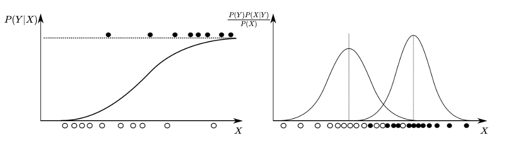
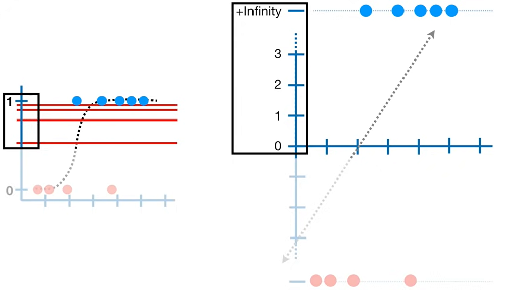
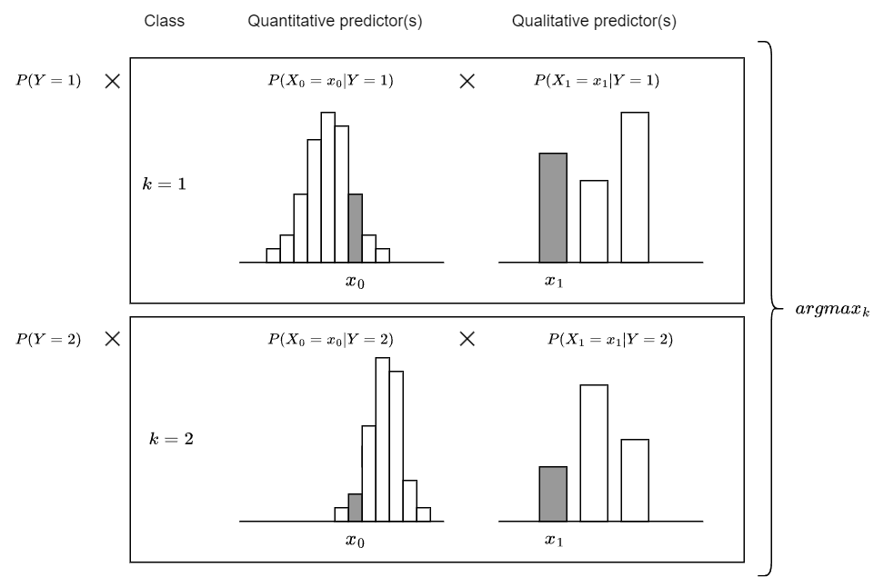

# 5 Linear Models for Classification

Classification is the problem of mapping variables to a categorical dependent variable. While in some cases there can be more than two categories, we can reduce the problem of classifying to a category or another and repeating for the latter. 

We can measure performance of classifier trough the error rate

$${1 \over n} \sum_{i=1}^nI(y_i \ne \hat y_i)$$

where $\hat y$ is predicted class for $i$ th observation and $I(y_i \ne \hat y_i)$ is an indicator having value of $0$ in case of misclassification and $1$ for correct classification.

The test error rate is minimized by maximizing the **Bayes classifier**, which assigns each observation to the most likely class, given the value $x_0$ of the predictor variable $X$.

$$argmax_j(P(Y = j | X = x_0))\tag{5.1}$$

We use $argmax$, because we need the $j$ class for the maximum probability and not the maximum probability itself.

Prediction of the Bayes classifier is determined by the so called **Bayesian decision boundary** where probability is $0.5$. The Bayes classifier produces the lowest error rate called **Bayes error rate**, which is the expectation of the error term over all values of $X$

$$1 - E[argmax_j(P(Y = j | X))]$$

The Bayes error rate is analogous to the irreducible error of linear models. The Bayes classifier in most cases is unknown and we would like to estimate it.

Proofs:
https://en.wikipedia.org/wiki/Bayes_classifier

Same as regression there are two main categories of classification: non parametric like KNN and parametric classification.

Parametric classifications can be further categorized based on the parameter estimation approach (see also **Figure 5.1**): 
* **Discriminative classifier**: we estimate probability of an observation to belonging to a particular value of categorical variable $Y$, drawing a separation boundary. Example: logistic regression.
* **Generative classifier** we estimate distribution of each class of $Y$ separately based on observations and using all estimates of an observation, we choose the maximum to decide final class. Examples:
  * Naive Bayes
  * Linear discriminant analysis (LDA), a dimensionality reduction technique
  * Quadratic discriminant analysis
  * Hidden Markov Model 

 <b>Figure 5.1: </b><i>Discriminative (left) vs generative (right) classifier</i>

## **5.1 K nearest neighbor classifier (KNN)**

KNN classifier tries to estimate the Bayes classifier, by finding the K nearest observation in training data closest to $x_0$ test observation

$$P(Y = j | X = x_0) = {1 \over K} \sum_{i \in N_0}I(y_j = j)$$

The classifier result will be the class $j$ of the maximum probability: $argmax_j(P)$

$$C^{KNN}(x) = argmax_j({1 \over K} \sum_{i \in N_0}I(y_j = j))$$

Small K values lead to higher variance, $K=1$ will perfectly fit the training data.

## **5.2 Logistic regression**

In logistic regression we model the probability of an observation belonging to one of two classes with logistic function. \output ranges between 0 and 1 (<b>Figure 5.2</b> left side)

$$P(X) = {e^{\beta_0 + \beta_1X_1 + ... +  \beta_pX_p} \over 1 + e^{\beta_0 + \beta_1X_1 + ... + \beta_pX_p}}$$

We can transform the above to odds form $p \over 1-p$

$P(X) = {e^z \over 1 + e^z}$ 
$P(X)\cdot(1 + e^z) = e^z$ 
$P(X) + P(X) e^z = e^z$ 
$P(X) = e^z(1-P(X))$ 
${P(X) \over 1 - P(X)} = e^z$

Giving

$${P(X) \over 1 - P(X)} = e^{\beta_0 + \beta_1X_1 + ... + \beta_pX_p}$$

Taking $log$ of both sides gives the log odds or **logit**

$$log\bigg({P(X) \over 1 - P(X)}\bigg) = \beta_0 + \beta_1X_1 + ... + \beta_pX_p$$

Which is a linear function, see right side of **Figure 5.2**

 <b>Figure 5.2: </b><i>Left side probability p, rights side logit transformation. Observations move from 0 to negative infinity and from 1 to infinity</i> (source StatQuest)

We can use categorical variables trough dummies, same as linear regression.

### **5.2.1 Fitting the model**

The logistic function can be fit using maximum likelihood. The likelihood function is

$$\ell(\beta_0, \beta_1) = \prod_{i:y_i=1}p(x_i)\prod_{j:y_j=1}\big (1 - p(x_j)\big )$$

### **5.2.2 Multinomial logistic regression**

Multinomial logistic regression is used to classify more than two classes. To achieve this we use a reference class and coefficients tell the relative change of one class probability compared to another. 

Model for classifying multiple classes when using the $K$ th class as reference for classes $k = 1...K-1$

$$P(Y=k|X=x) = {e^{\beta_{k0} + \beta_{k1}X_1 + ... + \beta_{kp}X_p} \over 1 + \sum_{l=1}^{K-1}e^{\beta_{l0} + \beta_{l1}X_1 + ... + \beta_{lp}X_p}}$$

and for class $K$

$$P(Y=K|X=x) = {1 \over 1 + \sum_{l=1}^{K-1}e^{\beta_{l0} + \beta_{l1}X_1 + ... + \beta_{lp}X_p}}$$

we can derive

$$log\bigg({P(Y=k|X=x) \over P(Y=K|X=x)}\bigg)=\beta_{k0} + \beta_{k1}X_1 + ... + \beta_{kp}X_p$$

Proof (with simplified notations): 
$log\big({P(k) \over P(K)}\big) = log\bigg({{e^{z_k} \over 1 + \sum_{l=1}^{K-1}e^{z_l}} \over {1 \over 1 + \sum_{l=1}^{K-1}e^{z_l}}}\bigg) = log({e^{z_k} \over 1}) = log(e^{z_k}) = z_k$

An alternative is to use softmax encoding, we estimate coefficients for all classes $k = 1...K$

$$P(Y=k|X=x) = {e^{\beta_{k0} + \beta_{k1}X_1 + ... + \beta_{kp}X_p} \over \sum_{l=1}^K e^{\beta_{l0} + \beta_{l1}X_1 + ... + \beta_{lp}X_p}}$$

and we calculate ration between classes $k$ and $k'$

$$log\bigg({P(Y=k|X=x) \over P(Y=K|X=x)}\bigg)=(\beta_{k0}-\beta_{k'0}) + (\beta_{k1}-\beta_{k'1})X_1 + ... + (\beta_{kp}-\beta_{k'p})X_p$$

Proof (with simplified notations): 
$log\big({P(k) \over P(k')}\big) = log\big({e^{z_k} \over e^{z_{k'}}}\big) = log(e^{z_k}) - log(e^{z_{k'}}) = z_k - z_{k'}$

### 5.2.3 Assessing the model

Each estimated coefficient has associated *z*-statistic
$$\hat \beta_1 \over \operatorname{SE}(\hat \beta_1)$$

If *z*-statistic is large, and the associated $p$-value is below a selected $\alpha$ we can reject the null hypothesis: $H_0: \beta_1 = 0$

## **5.3 Generative Models for Classification**

Instead of directly estimating $P(Y = y|X = x)$ we estimate the distribution $P(X|Y=k)$ for each value $k$ of $Y$ and then we use Bayes rule to flip the conditional and calculate $P(Y = y|X = x)$.

If $P(Y = k)$ is the overall probability that an observation belongs to class $k$ (i.e $n_k \over n$ where $n_k$ is samples in class $k$ and $n$ is total number of samples of our training data) and $P(X | Y = k)$ is the distribution of a single class, using Bayes rule we get

$$P(Y = k|X = x) = {P(Y = k) P(X = x | Y = k) \over \sum_{l=1}^K P(Y = l) P(X = x | Y = l)}\tag{5.2}$$

The denominator makes sure the resulting probability distribution sums to $1$.

Benefits of generative models over logistic regression:

* Can be easily applied to more then two class in the output
* If separation of classes is more prominent, generative models are more stable.

The challenge is to estimate the distribution of samples within each class $P(X = x | Y = k)$, for which techniques such as linear discriminant analysis or naive bayes can be used, described below. 

### **5.3.1 Linear discriminant analysis**

### **5.3.2 Naive Bayes classifier**

In case of the Naive Bayes classifier we make the assumption that within the class $k$ of $Y$, the predictor variables are independent:

$$P(X = x | Y = k) = \prod _{j}P(X_j = x_j | Y = k)\tag{5.3}$$

Where $X_1, ..., X_p$ are the predictor variables, and $x_1, ..., x_p$ are values of an observation (the one we are classifying) for each predictor. While in most cases the predictor variables are not independent, estimating the covariance between all combinations of predictor variables is very difficult. With this assumption, some bias is introduced in favour of reducing variance (we reduce model parameters, see bias-variance trade off). If we plug in equation (5.3) to (5.2) and the result to (5.1) we get the following result:

$${\displaystyle C^{\text{Bayes}}(x)={\underset {k}{\operatorname {argmax} }}\operatorname {P} (Y=k)\prod _{j} P(X_j = x_j|Y=k)}$$

Complete breakdown for reference  
$\displaystyle C^{\text{Bayes}}(x)=argmax_k(P(Y = k | X = x))$ 
Plugging in (5.2) but notating the denominator with $\alpha$ for simplicity
$\displaystyle C^{\text{Bayes}}(x)=argmax_k \biggl( {P(Y = k) P(X = x | Y = k) \over \alpha} \biggr)$ 
Since $\alpha$ is positive and constant for all terms, it will not change the outcome of $argmax$, we caan simply omit 
$\displaystyle C^{\text{Bayes}}(x)=argmax_k \bigl( P(Y = k) P(X = x | Y = k) \bigr)$ 
Finally we plug in the (5.3) assumption 
$\displaystyle C^{\text{Bayes}}(x)=argmax_k \bigl( P(Y = k) \prod _{j}P(X_j = x_j | Y = k)] \bigr)$ 

To complete the classification task, estimating $P(X_j = x_j|Y=k)$ for each predictor $X_1, ..., X_j$ is remaining. There are a few ways to achieve this.

* If $X_j$ is quantitative, we can assume $P(X_j|Y = k)$ to be normally distributed, in this case we can follow the same process as QDA, with an added assumption that the covariance matrix of each class is diagonal
* An alternative in case of a quantitative $X_j$ is to use a kernel density estimator or simply create a histogram from the training data, normalize it so the sum of bins is $1$ and use the bin height for $x_0$ (see Quantitative predictor on Figure 5.3).
* For a qualitative $X_j$ we can follow a similar process to the histogram one: count all training observation for each class. The resulting probability $P(X_j = x_j|Y=k)$ is the ratio of the occurrences of $x_0$ in the training data for the class $k$ to the total number of training samples occurring for the class $k$ (see Qualitative predictor Figure 5.3).

 <b>Figure 5.3: </b> Naive bayes classifier. For each class we calculate the product of the probability of the input of all predictors independently, finally choose the class with highest probability.

## **5.4 Evaluating classifiers**

<table>
  <tr>
    <td colspan="2" rowspan="2"></td>
    <th align="center" colspan="2">Predicted class</th>
    <td rowspan="2"></td>
  </tr>
  <tr>
    <th align="center">Positive</th>
    <th align="center">Negative</th>
  </tr>
  <tr>
    <th rowspan="2">Actual class</th>
    <th align="center">Positive</td>
    <td align="center">True Positive (TP)</td>
    <td align="center">False Negative (FN) Type II error</td>
    <td align="center"><b>Sensitivity or Recall</b> $$TP \over TP + FN$$</td>
  </tr>
  <tr>
    <th align="center">Negative</td>
    <td align="center">False Positive (FP) Type I error</td>
    <td align="center">True Negative (TN)</td>
    <td align="center"><b>Specificity</b> $$TN \over TN + FP$$</td>
  </tr>
  <tr>
    <td colspan="2"></td>
    <td align="center"><b>Precision</b> $$TP \over TP + FP$$</td>
    <td colspan="2"></td>
  </tr>
</table>

