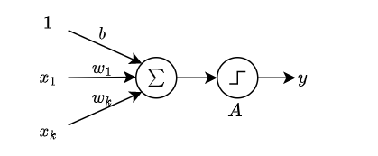
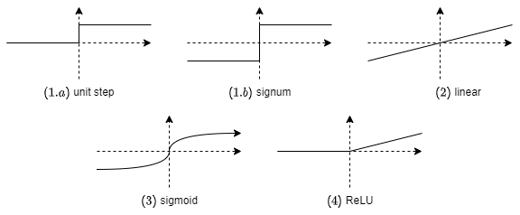
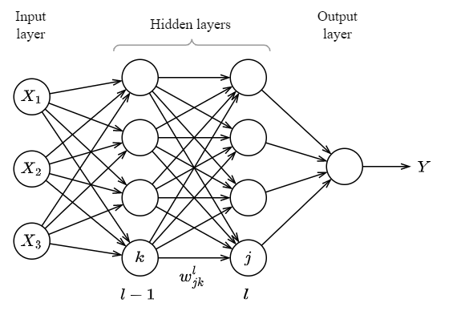

# **6. Neural networks**

## **6.1 Feed forward networks**

### **6.1.1 Perceptron**

 <b>Figure 6.1: </b><i>Model of a neuron</i>

The input of a perceptron is the dot product of inputs and weights. The threshold of activation or **bias** of the perceptron is modelled with an added input $1$ and $b$ weight.

Using the dot product $z = b + w \cdot x = b + \sum_j w_jx_j$ the model we use various activation functions

 <b>Figure 6.2: </b><i>Activation functions</i>

1. Step function: can be either unit step 

$$h = \begin{cases}
0 & \operatorname{if }\ z > 0 \\
1 & \operatorname{if }\ z \le 0
\end{cases}
$$

or signum, where $-1$ is used instead of $0$. The challenge with this is that small change in the input might trigger a jump from $0$ to $1$ times weights, which might be a sudden big jump and if organized to netwerk it might not learn.

2. Linear

$$h = z $$

Same as linear regression. In case multiple neurons are connected will still collapse to linear model. To be able to model non linear functions, the activation should also be non linear

3. Sigmoid

$$h = {1 \over 1 + e^{-z}}$$

Small changes in the input will result in small changes in the output because the function is continuous.

$$\Delta h \approx \sum_j {\partial h \over \partial w_j} \Delta w_j $$

Sigmoid can become saturated on values close to $0$ (low) and $1$ (high) because the derivate becomes close to $0$.

3. Rectifier Linear Unit: ReLU

$$h = max(0, z)$$

A variant is the **leaky ReLU** which allows small negative values to be passed trough. It:s defined as 

$$h = max(az, z)$$

where $a$ is a very small constant (e.g. $0.0001$). While the rectified unit is not continuous and it has some issues like vanishing or exploding gradient in learning, it:s still very popular due to it:s simplicity and good performance in practice if used as part of large neural netwworks.

### **6.1.2 Network structure**

In feed forward networks, output of neurons in a layer act as inputs in the next layer

 <b>Figure 6.3: </b><i>Architecture of a feed forward neural network with 3 inputs and 2 hidden layers</i>

To train the model we can choose a loss function $C$ we could minimize. To minimize $C$ we can define a change in $C$ as

$$\Delta C \approx \sum_k { \partial C \over \partial w_k} \Delta w_k = \nabla C \Delta w_k \tag{6.2}$$

We can make a decrease in the cost function $C$ by choosing $\Delta w_k$ as

$$\Delta w_k = -\eta \nabla C$$

Where $\eta$ is the learning rate. Plugging it to (6.2) we get

$$\Delta C \approx - \eta \| \nabla C \| ^ 2$$

Since $\| \nabla C \| ^ 2$ is positive, $- \eta$ is negative, so will always result in moving in direction of decrease in $\Delta C$. The update rule of weights to minimize the cost function $C$ is

$$w_k' = w_k - \eta { \partial C \over \partial w_k}$$

Similarly we can write the same for bias as well

$$b' = b - \eta { \partial C \over \partial b}$$

the mean squared error (MSE) could be used as a loss function to be minimized 

$$C(w) = \sum_{x \in \{1..n\}} \| y(x) - a \| ^2 \tag{6.1}$$

where $n$ is training inputs, $a$ the output for input $x$. $\| \ \|^2$ is notation for distance.

The MSE is often used with ReLU but does not work well with sigmoid neurons. If the neuron haas to learn too much, and adjust from one side to another, the initial learning rate might be slow (until the learning gets to the steep part of the sigmoid function). Because of this a better alternative to be used with sigmoid is the **cross entropy cost function**

$$C = -{1 \over n}\sum_x[y \ln a + (1 - y) \ln (1-a)]$$

To see why this seemingly complex function is useful, we could check the learning rate for a single sigmoid neuron, notated with $\sigma(z)$ the partial derivate against a weight $w$:

${\partial C \over \partial w_j} = {\partial \over \partial w_j }{\big ( -{1 \over n}\sum_x(y \ln \sigma(z) + (1 - y) \ln (1-\sigma(z)))\big ) }$ 

$ = -{1 \over n}\sum_x \left ( {\partial \over \partial w_j}\big ( y \ln \sigma(z)\big ) + {\partial \over \partial w_j} \big ((1 - y) \ln (1-\sigma(z))\big )\right )$ 

Because $ln(x)' = {1 \over x}$

${\partial C \over \partial w_j} = -{1 \over n}\sum_x \left ( {y \over \sigma(z) } {\partial \sigma(z) \over \partial w_j} - {1 - y \over 1-\sigma(z)} {\partial \sigma(z) \over \partial w_j}\right )$ 

Notice how the sign in the middle flipped because of $ln'(1-\sigma(z))$

${\partial C \over \partial w_j} = -{1 \over n}\sum_x \left ( {y \over \sigma(z) } - {1 - y \over 1-\sigma(z)}\right ) {\partial \sigma(z) \over \partial w_j} $ 

Since $z = b + \sum_j x_jw_j$ the derivate will be ${\partial \sigma(z) \over \partial w_j} = \sigma'(z) z'(w_j) = \sigma'(z) x_j$, pluggin in

${\partial C \over \partial w_j} = -{1 \over n}\sum_x \left ( {y \over \sigma(z) } - {1 - y \over 1-\sigma(z)}\right ) \sigma'(z)x_j $ 

We can rewrite ${y \over \sigma(z) } - {1 - y \over 1-\sigma(z)} = {y(1-\sigma(z)) - (1 - y)\sigma(z) \over \sigma(z) (1-\sigma(z)) } = {y - \sigma(z) - y\sigma(z) + y\sigma(z) \over \sigma(z) (1-\sigma(z))} = {y - \sigma(z) \over \sigma(z) (1-\sigma(z))}$. We get

${\partial C \over \partial w_j} = -{1 \over n}\sum_x \left ( {y - \sigma(z) \over \sigma(z) (1-\sigma(z))}\right ) \sigma'(z)x_j $ 

Using the definition of sigmoid $\sigma(z) = {1 \over 1 + e^{-z}}$, and the rule $ \left( 1 \over f \right )' = (f^{-1})' = -f^{-2} f' $ we can calculate 

$\sigma'(z) = \left (-{1 \over ( 1 + e^{-z})^2} \right ) e^{-z} (-1) = {e^{-z} \over ( 1 + e^{-z})^2 } = {1 \over  1 + e^{-z}} {e^{-z} \over 1 + e^{-z}} = {1 \over  1 + e^{-z}} {1 + e^{-z} - 1 \over 1 + e^{-z}} = {1 \over 1 + e^{-z}} \left ( 1 - {1 \over  1 + e^{-z}} \right ) = \sigma(z)(1 - \sigma(z))$. Plugging the result, i.e $\sigma'(z) = \sigma(z)(1 - \sigma(z))$ to ${\partial C \over \partial w_j}$ will give

${\partial C \over \partial w_j} = -{1 \over n}\sum_x \left ( {y - \sigma(z) \over \sigma(z) (1-\sigma(z))}\right ) \sigma(z)(1 - \sigma(z)) x_j = -{1 \over n}\sum_x(y - \sigma(z))x_j$ 

The result shows that the learning rate ${\partial C \over \partial w_j}$ is proportional to the difference between expected and actual output $y - \sigma(z)$. The larger the difference the better the learning rate. The same is not true if we use MSE with sigmoid.

**Stochastic Gradient descent**

Because (6.1) iterates trough all input data, calculating weight updates might be costly. For each update we can select a subset of size $m$ of training data, noted with $X_j$, called mini batch to update the weights. The update wouldtake the form

$$w_k' = w_k - {\eta \over m} { \partial C_{X_j} \over \partial w_k} $$

In some cases the $1 \over m$, which scales the learning rate with batch size, can be ommitted.

A complete iteration over all training data trough batches is called an **epoch**.

### **6.1.4 Backpropagation**

Backprograpagation is the algorithm used in training, specifically for calculating

$${\partial C \over \partial w} \operatorname{ and } {\partial C \over \partial b}$$

for a network with multiple neurons and layers.

**Assumptions of backpropagatation**

1. The cost function $C$ can be written as the average of the cost function for all training samples $x$ noted $C_x$. This assumption is needed because backpropagation is done per training sample

$$C = {1 \over n} C_x$$

2.  The cost function can be written as a function of the outputs of the network. Having $L$ as the number of layers

$$C = C(A^L)$$

**Notations**

* $w_{jk}^l$ as the weight from $k$ th neuron in $l-1$ th layer to $j$ neuron in $l$ th layer (figure 6.3)
* $b_j^l$ is bias of the $j$ th neuron in layer $l$
* $h$ activation method used
* $A_j^l$ is activation of the $j$ th neuron in layer $l$

The activation function

$$A_j^l = h(b_j^l + \sum_k w_{jk}^l A_j^{l-1})$$

Transforming to matrix form

* $w^l$ is the weight matrix of layer $l$ where columns are  $k$ ($l-1$ layer neuron) and rown are $j$ ($l$ layer neuron) for weight $w_{jk}^l$  
* $b^l$ bias vector
* Applying a function to a vector is equivalent of applying to all vector elements: $h(z)_j \equiv h(z_j)$ 
* $A^l$ activation vector becomes$$A^l = h(z^l) = h(b^l + w^l A^{l-1})$$ The reversal of order of $j$ and $k$ in $w_{jk}^l$ is to eliminate the transpose $w^T$ of weight matrix $w$ in the above equation.
* Hadaman product is the element wise product of two vectors resulting in a vector, noted with $\odot$ $$(s \odot t)_j = s_j t_j$$

**Equations of backpropagation**

Backpropagation is an algorithm to calculate ${\partial C \over \partial w^l}$ and ${\partial C \over \partial b^l}$, by introducing an error term in the $j$ th neuron noted with $\delta_j^l$ 

By making a weighted input change of a neuron $\Delta z_j^l$, this would cause the output of neuron to be $h(z_j^l + \Delta z_j^l)$, overall cost would change ${\partial C \over \partial z_j^l} \Delta z_j^l$. To minimize cost, we can choose $\Delta z_j^l$ to be $- {\partial C \over \partial z_j^l}$, so that it would result in a minus squared term which is always negative, and thus would help us reduce the cost function. Thus the error term we can choose is

$$\delta_j^l = {\partial C \over \partial z_j^l} \tag{6.3}$$

The vector $e^l$ is the error term for layer $l$.

**Error in out payer** (element wise and matrix form):

$$\delta_j^L = {\partial C \over \partial A_j ^ L} h ' (z_j^L)$$

$$\delta^L = \nabla _AC \odot h(z^L) \tag{BP1}$$

Proof:

Start with (6.3) 
$\delta_j^l = {\partial C \over \partial z_j^l}$ 
applying the chain rule  
$\delta_j^l = \sum_k{\partial C \over \partial A^L_k}{\partial A^L_k \over \partial z_j^l}$ 
Since activation $A$ of $k$ th neuron depends only of the weighted input of the same neuron $z$ we can eliminate all terms where $k \ne j$ 
$\delta_j^l = {\partial C \over \partial A^L_j}{\partial A^L_j \over \partial z_j^l}$ 
Because by definition $A^L_j = h(z_j^L)$ we can rewrite the second term 
$\delta_j^l = {\partial C \over \partial A^L_j}h'(z_j^L)$ 

**Error of layer $l$ in respect to error in laer $l+1$**

$$\delta^l = \big ((w^{l+1})^T \delta^{l+1}\big ) \odot h(z^l) \tag{BP2}$$

The first half moves the error backward a layer, the second half, moves error trough the layer

(BP1) and (BP2) allow calculating the error $e$ for all layers

Proof:

Start with (6.3) 
$\delta_j^l = {\partial C \over \partial z_j^l}$ 
applying the chain rule, in terms of  
$\delta_j^{l+1} = {\partial C \over \partial z_j^{l+1}}$ 
we get  
$\delta_j^l = \sum_k{\partial C \over \partial z_j^{l+1}}{\partial z_j^{l+1} \over \partial z_j^l}$ 
$\delta_j^l = \sum_k{\partial z_j^{l+1} \over \partial z_j^l}\delta_k^{l+1}$ 
The first term 
${\partial z_j^{l+1} \over \partial z_j^l} = {\partial \sum_j w_{kj}^{l+1} f(z_j^l) + b_k^{l+1} \over \partial z_j^l} = w_{kj}^{l+1}h'(z_j^l)$ 
Adding it back  
$\delta_j^l = \sum_k w_{kj}^{l+1} \delta_k^{l+1} h'(z_j^l)$ 
Writing in matric form we get 
$\delta^l = \big ((w^{l+1})^T \delta^{l+1}\big ) \odot h(z^l)$

**Rate of change of cost in respect to bias**

$${\partial C \over \partial b^l} = \delta^l \tag{BP3}$$

Proof:

${\partial C \over \partial b^l} = \sum_k {\partial C \over \partial z_k^l}{\partial z_k^l \over \partial b_j^l}$ 
Since $z_k^l$ only dependson on $b_j^l$ where $k = j$ 
${\partial C \over \partial b^l} = {\partial C \over \partial z_j^l}{\partial z_j^l \over \partial b_j^l} = \delta^l{\partial z_j^l \over \partial b_j^l}$ 
${\partial C \over \partial b^l} = \delta^l{\partial \sum_j w_{kj}^l f(z_j^{l-1}) + b_k^l \over \partial b_j^l}$ 
The second term is simply $1$ resulting in 
${\partial C \over \partial b^l} = \delta^l$

**Rate of change of cost in respect to weights**

$${\partial C \over \partial w^l} = A^{l-1}\delta^l \tag{BP4}$$

Proof

${\partial C \over \partial w^l} = \sum_m {\partial C \over \partial z_m^l}{\partial z_m^l \over \partial w_{kj}^l}$ 

${\partial C \over \partial w^l} = \sum_m {\partial C \over \partial z_m^l}{\partial \sum_n w_{mn}^lA_n^{l-1} + b_m^l \over \partial w_{kj}^l}$ 
and only when $m = j$ and $n = k$, the derivative is not $0$, so here we get 

${\partial C \over \partial w_{jk}^l} = {\partial C \over \partial z_j^l}A_k^{l-1} = A^{l-1}\delta^l$

The algorithm (using mini batches)

1. For each input of a mini batch $x$, use as $A^1$ of input layer
    1. Feed forward trough layers $l = 2, 3, ..., +L$ with $z^l = w^lA^{l-1} + b^l$ and ${A^l} = h(z^l)$
    2. Calculate output error with (BP1)
    3. Backpropagate error with (BP2)
5. Adjust weights and biases with learning rate times the average of gradients given by (BP3) and (BP4)

The reason backpropagation is faster than forward learning is because we would need to compute the gradient for all combinations of weights for each layer. Since most of the computation is redundant in the sense that partial gradients are recalculated multiple times, for each forward path, the backpropagation algoroithm optimizes on this to compute only once.

## References

**An Introduction to Statistical Learning, with applications in R, Second Edition**, Gareth James, Daniela Witten, Trevor Hastie, Rob Tibshirani

**Neural Networks and Deep Learning**, Michael Nielsen 2019
