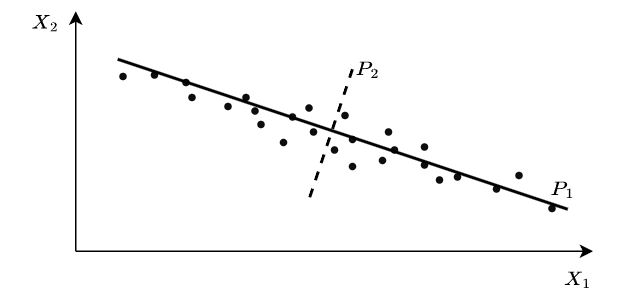

# **8 Dimensionality reduction**

Supervised machine learning models in most cases require that training data or sample size $n$ is much greater than the number of predictors or features $p$ 

$$n \gg p$$

Linear models will have high variance and overfit data as $p$ gets closer to $n$. If $p = n$, ordinary least squares linear regression will perfectly fit the data, and will perform poorly an a test set.

Adding features as dimensions to a linear model will increase $R^2$ even though the model fit quality decreases. $R^2$ can be adjusted to number of features. It is defined as:

$$R^2_{adj} = 1 - {(n-1)RSS \over (n - p - 1)TSS}$$

WIth each added dimension, the data sparsity increases exponentially, because the volume of the data hypercube also increases exponentially. This is called the **curse of dimensionality**. Dimensionality reduction techniques help reduce the dimensionality of features while preserving as much as possible about the data conveyed. 

A number of techniques have been proposed to reduce dimensionality ranging from linear techniques to neural network based techniques.

## **8.1 Dimensionality reduction for linear models**

Linear dimensionality redcution methods transform a linear model to a lower number of predictors by substituting to another smaller set of predictors.

Let the following be a linear model

$$Y = \beta_0 + \sum_{i=1}^p\beta_iX_i$$

Where $Y$ and $X_i$ are a vector of size $n$, where $n$ is the sample size. We can define a linear transformation to a lower dimension $M$, as

$$Z_m = \sum_{j=1}^p \phi_{jm}X_j$$

where $M<p$ and $m = 1,...,M$ and $\phi_{jm}$ are the parameters for dimensionality reduction. We can rewrite our model with the new parameters $Z_m$ as:

$$Y = \theta_0 + \sum_{m=1}^M\theta_mZ_m$$

We can fit this model with less parameter: $M + 1$, compared to $p + 1$, where $M < p$. We can fit the model with ordinary least squares in the same way we would fit the original model. It's called dimensionality reduction, because we reduced the number of model parameters.

The relationship between the model parameters are:

$$\beta_j = \sum_{m = 1}^M\theta_m \phi_{jm}$$

So far we omitted the task on choosing the $\phi_{jm}$ parameters. Depending on how we choose them, OLS on the reduced model might provide a better fit. 

### **8.1.1 Principal Component Analysis**

A number of methods have been proposed for choosing the $\phi_{jm}$ like **Principal Component Analysis** (PCA). It's a form of **unsupervised learning**, which means no training dataset is needed. PCA can be used to reduce the dimension of an $n \times p$ matrix. 

The PCA method remaps the basis vectors of the dataset (in Figure 8.1 the basis vectors are unit vectors on the axis $X_1$ and $X_2$ respectively). The first principal component we choose in PCA is the one where the variance of the data is maximum (in Figure 8.1 the diagonal continuous line). Projecting the observations to the line of the first principal component results in the largest variance of the projected data, compared to any other line. In other words, the first principal component is the line closest to the data.

 <b>Figure 8.1: </b> Principal components of a two dimensional dataset

Since in the example there is high correlation between $X_1$ and $X_2$, the first principal component captures this relationship. The second component is chosen to capture the remaining maximum variance, in this case the remaining variance. Principal components are uncorrelated, so they are perpendicular to one another. 

When we have $p$ features, we can choose in the same way up to $p$ principal components. Since we maximize capturing variance with each component we can limit the number of components to $M$, where $M < p$, resulting in dimensionality reduction, while still minimizing data loss.

