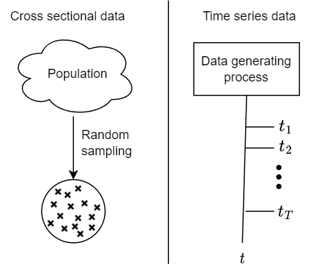
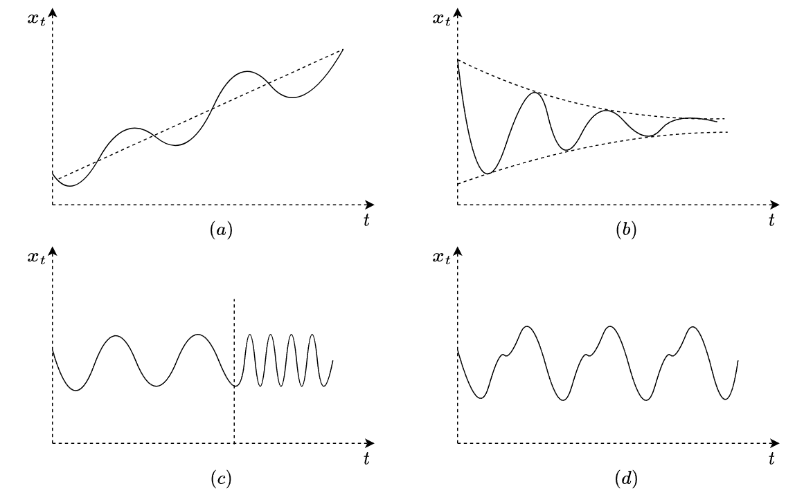
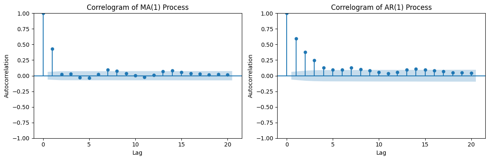
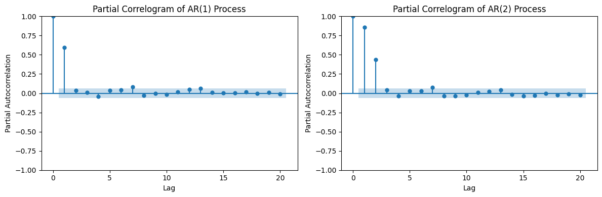

# **9 Time series analysis and forecasting**

In this chapter we will explore time series analysis and forecasting techniques. We will start with linear models and move on to more complex ones.

In **time series** data we don't really have a population, instead we have a data generating process, that we are sampling at certain points in time. Population would mean all observations at any given time, which would mean an infinite number of observations. 

 <b>Figure 9.1: </b> Cross sectional data (left) vs time series data (right)

## **9.1 Linear models for time series analysis**

In the case of linear regression, the Gauss-Markov conditions are required for OLS to provide the best linear unbiased estimator (BLUE). However, for time series analysis, other linear models may be more appropriate. 

### **9.1.1 Assumption of linear models for time series**

Time series linear models require some modifications to the Gauss-Markov assumptions, such as the inclusion of strict exogeneity instead of weak exogeneity. Nevertheless, in practice, when the sample size is large enough, similar conditions apply.

In cross-sectional data analysis, the assumption is that the samples are independent and identically distributed (i.i.d). However, in time series analysis, the assumption of independence no longer holds due to temporal dependence between the observations. Instead of assuming i.i.d, we introduce the concept of **weak dependence**.

A time series is considered weakly dependent if the correlation between a value and a lagged value tends to zero as the lag tends to infinity:
$$Corr(x_t, x_{t+h}) \rightarrow 0, h \rightarrow \infty$$

This condition serves as a replacement for the random sampling assumption in cross-sectional data. Since the correlation becomes minimal as the lag increases, we can treat the observations as if they were i.i.d, allowing us to perform inference.

Some of the linear models we can use for time series require that the time series is **stationary**. The conditions for stationary time series are 

1. **Stationary in mean**: the expectation of all the variables is a finite constant, and not a function of time. $$E[x_t] = \mu < \infty, E[x_t] \neq f(t)$$ This means there is no gradual growth with time in our variables. 
2. **Stationary in variance**: the variance of all the variables is a finite constant, and not a function of time* $$Var(x_t) = \sigma^2 < \infty, Var(x_t) \neq f(t)$$  
3. **Covariance stationary**: The covariance of a value of the time series and one which is lagged needs to be a function of the lag and not time. $$Cov(x_t, x_{t+h}) = f(h) \neq f(t)$$

These conditions ensure that the statistical properties of the time series remain constant over time

 <b>Figure 9.2: </b> (a) Non-stationary in mean, (b) non-stationary in variance, (c) time-varying autocovariance (non covariance stationary), (d) stationary time series

If we try to apply linear model to a non stationary variable or a predictor variable is non stationary, the following issues might arise:
* When we try to model a variable $y$ on $x$, if only $y$ is non stationary, there is no linear relationship we could describe ($y$ has a slope but $x$ does not, so there is no $y = \beta_0 + \beta_1 x$ that can model the relationship)
* If both $x$ and $y$ are not stationary, but the degree of growth is different, e.g. $x$ has a linear growth but $y$ has an exponential growth, we arrive to the same problem where we are not able to model one variable with another using linear model.
* Even if both $x$ and $y$ have a linear slope, the relationship between the independent and dependent variable might simply be sporadic correlation (accidental). We could model a growing variable with another, even if there is no relationship. A famous example is a study in 1970 about the increase in margarine consumption and divorce rate in the US. 

There is also a theoretical reason, which is related to the law of large numbers and the central limit theorem, that we will not explore here.

### **9.1.2 The MA model**

We call a data generating process **moving average** if the model has the following form:

$$\operatorname{MA}(k): x_t = \epsilon_t + \theta_1\epsilon_{t-1}  + ... + \theta_k\epsilon_{t-k} $$ 

where $\theta_1, ..., \theta_k$ are the weights of the model, and $\epsilon_{t-1},...,\epsilon_{t-k}$ are i.i.d error terms:

$$\epsilon_{t-1},...,\epsilon_{t-k} \sim i.i.d(0, \sigma^2)$$

The moving average process is stationary and weekly dependent. We can simply find this by applying the model equation to the conditions. Applying to MA(1):

1. $E[x_t] = E[\epsilon_t] + \theta E[\epsilon_{t-1}] = 0$ — constant mean, not a function of time
2. $Var(x_t) = Var(\epsilon_t) + \theta^2 Var(\epsilon_{t-1}) = \sigma^2(1 + \theta^2)$ — constant variance, not a function of time
2. $\operatorname{Cov}(x_t, x_{t-1}) = \operatorname{Cov}(\epsilon_t + \theta\epsilon_{t-1}, \epsilon_{t-1} + \theta\epsilon_{t-2})$

    We can expand the covariance same as multiplication, but we know error terms are independent, so we only need to consider the recurring error term $\epsilon_{t-1}$: 

    $= \theta \operatorname{Cov}(\epsilon_{t-1}, \epsilon_{t-1}) = \theta Var(\epsilon_{t-1}) = \theta \sigma ^2$

    For a lag $h$ larger than $1$

    $\operatorname{Cov}(x_t, x_{t-h}) = 0$

    Overall it's a function of the lag and not of time

Similarly the correlation will also become $0$ for lag larger than the lag in the model, making it weakly dependent.

### **9.1.3 The AR model**

The **auto regressive** or AR model assumes a relationship in the time series between a point in time and a given lag. 

$$\operatorname{AR}(k): x_t = \rho_0 + \rho_1 x_{t-1} + ... + \rho_k x_{t-k} + \epsilon$$

Where $\rho_1, ..., \rho_k$ are the model parameters, $\epsilon$ is the error term, which is i.i.d with a mean of $0$ and a variance of $\sigma^2$:

$$\epsilon \sim i.i.d(0, \sigma^2)$$

The AR model is stationary under certain conditions. If we examine AR(1) and apply it for the conditions of stationary. 

1. Stationary in mean: 

    $E[x_t] = \rho_0 + \rho_1 E[x_{t-1}] + E[\epsilon_t]$  
    $E[\epsilon_t]$ is simply 0 from the definition. In order for the process to be stationary it must hold that $E(x_t) = E(x_{t−1})$  (we will reuse this several times below), substituting these:  
    $E[x_t] = \rho_0 + \rho_1 E[x_t] \Leftrightarrow$  
    $$E[x_t] = {\rho_0 \over 1 - \rho_1}$$

    For the process to be stationary, we need $E[x_t]$ to be finite, which means $$\rho_1 \neq 1$$ needs to hold, otherwise it's division by 0.

2. Stationary in variance: 

    $Var(x_t)=Var(\rho_0+\rho_1x_{t-1}+\epsilon_t)=\rho_1^2V(x_{t-1})+\underbrace{2Cov(x_{t-1},\epsilon_t)}_{=0}+\underbrace{Var(\epsilon_t)}_{\sigma^2}$. In order for the process to be stationary it must hold that $Var(x_t) = Var(x_{t−1})$:  
    $Var(x_t)=\rho^2Var(x_t)+\sigma^2 \Leftrightarrow$ 

    $$Var(x_t)={\sigma^2 \over 1-\rho_1^2}$$ 

    The variance to be positive and finite, we need  
    $\rho_1^2<1 \Leftrightarrow$ 
    
    $$\vert \rho \vert <1$$

3. Covariance stationary: 

    We can take result of 1., rearrange the elements:

    $E[x_t] = {\rho_0 \over 1 - \rho_1}$  
    $\rho_0 = (1 - \rho_1)E[x_t]$  
    And use this to change the center of the process (original AR(1) formula), removing $\rho_0$: 
    $x_t-E(x_t)=\rho_1(x_{t-1}-E(x_t))+\epsilon_t$

    Since it's a recursive function and because $E(x_t) = E(x_{t-1})$, we can substitute $x_{t-1}-E(x_t)$ with $\rho_1(x_{t-2}-E(x_t))+\epsilon_t$:

    $x_t-E(x_t)=\rho_1^2(x_{t-2}-E(x_t))+\rho_1\epsilon_{t-1} + \epsilon_t$

    Repeating $h$ times:

    $x_t-E(x_t)=\rho_1^k(x_{t-h}-E(x_t))+\sum_{i=0}^{h-1}\rho_1^i\epsilon_{t-i}$

    Shifting by $h$  (note that again we don't need to update $E(x_t)$)

    $x_{t+h}-E(x_t)=\rho_1^k(x_{t}-E(x_t))+\sum_{i=0}^{h-1}\rho_1^i\epsilon_{t+h-i}$

    Calculating covariance with the shifted value (auto covariance), because there is no relationship between $x$ and the error terms, $\sum_{i=0}^{h-1}\rho_1^i\epsilon_{t+h-i}$ becomes $0$:

    $Cov(x_t-E(x_t), x_{t+h}-E(x_t))$ 
    $= Cov(x_t-E(x_t), \rho_1^k(x_{t}-E(x_t)))$  
    $= \rho_1^k Cov(x_t-E(x_t), x_t-E(x_t))$ 
    $= \rho_1^k Var(x_t-E(x_t))$ 
    Redoing tha calculation for stationary in variance (2) but with centered process, gives the same result:  
    $= \rho_1^k {\sigma^2 \over 1-\rho_1^2}$

    This has the same condition as the stationary in variance: $\vert \rho \vert <1$

### **9.1.4 AR or MA process**

A process that is stationary in mean and variance can be either an AR or an MA process. To diagnose wheater a process is AR or MA, we can look at the autocorrelation, which is:

$Corr(x_t, x_{t+h}) = {Cov(x_t, x_{t+h}) \over \sqrt{Var(x_t)Var(x_{t+h})}}$

Because the process is stationary, the variance is constant, so $Var(x_t) = Var(x_{t+h})$

$$Corr(x_t, x_{t+h}) = {Cov(x_t, x_{t+h}) \over {Var(x_t)}} \tag{9.1}$$

For an MA(1) process, for $h = 1$: ${Cov(x_t, x_{t+h}) \over {Var(x_t)}} = {\theta \sigma ^2 \over \sigma ^2(1 + \theta^2)} = {\theta \over 1 + \theta^2}$. For values larger than 1, it was simply 0:

$$Corr_{MA}(x_t, x_{t+h}) = \begin{cases}
{\theta \over 1 + \theta^2} & ,\ h = 1 \\
0 & ,\ h > 1
\end{cases}  \tag{9.2}$$

For an AR(1) process we found that $Cov(x_t, x_{t+h}) = \rho^k Var(x_t)$, applying to (9.1) we get:

$$Corr_{AR}(x_t, x_{t+h}) = \rho^k  \tag{9.3}$$

While these results look complex they can be very intuitive in identifying if a process is AR or MA. We can plot a graph of our time series, where on the $X$ axis we have integers $1, 2, ...$ representing lag, and for each we plot the auto correlation with that lag. This plot is called a **correlogram**.

 <b>Figure 9.3: </b> Correlogram of an MA(1) and an AR(1) process.

On **Figure 9.3** we can see the correlogram of an MA(1) and an AR(1) process. All processes have an autocorrelation of 1 with itself with lag 0, so that value does not convey information. The result in (9.2) shows that an MA(1) process will have some value for it's auto correlation at lag $1$ and $0$ for lag $>1$, which is similar to the left side of **Figure 9.3**. The shaded area around the X axis shows statstically insignificant range, correlation values which fall within this range are sampling noise.

An AR(1) model has a non $0$ auto correlation at lag $k$, but it:s decaying exponentially as conveyed by (9.3). This same behavior is visible on the right hand side of **Figure 9.3**.

To differenciate an AR(1) processes from AR(2) or higher order, we can use **partial autocorrelation functions**. Partial autocorrelation counts correlation only once, at the lowest lag. The way it does it, it substracts the effect at lag $k$ from the process and uses this result calculates autocorrelation for the next lag, at $k+1$ for all $k=1,2,...$

 <b>Figure 9.4: </b> Partial correlogram of an AR(1) and an AR(2) process.

### **9.1.5 Random walk**

An AR(1) process with $\rho$ of $1$ is called a **random walk**: 

$x_t = x_{t-1} + \epsilon_t$ 
$x_t = x_{t-2} + \epsilon_{t-1} + \epsilon_t$ 
$x_t = x_0 + \sum_{i=0}^{t-1} \epsilon_{t-i}$

Since the condition for stationary of variance is violated, it's non stationary time series.

$Var(x_t) = Var(\sum_{i=0}^{t-1} \epsilon_{t-i}) = \sum_{i=0}^{t-1} Var(\epsilon_{t-i})$ 
From $\epsilon_i \sim i.i.d(0, \sigma^2)$, having $t$ count of noise terms 
$Var(x_t) = t \sigma^2$ which is non constant but a function of time.

### **9.1.5 SARIMAX**

SARIMAX is a commonly applied time series analysis technique, it is actually a combination of multiple techniques:

* AR: Autoregression
* MA: Moving Average
* I: Adding differencing to ARMA
* S: Seasonality added it ARIMA
* X: External parameter added (moving from single variate to multi variate)