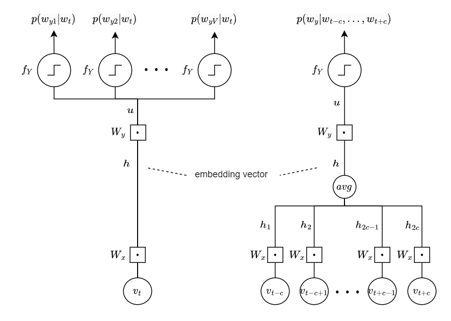

# **10. Natural language processing**

**Natural language processing** or **NLP** for short the field of AI concerned with working with natural languages like English (as opposed to programming language like Python) is one of the fastest growing fields of AI in recent years.

## **10.1 Common NLP terms and statistics**

**Tokenization** breaks a text into tokens, in most cases words. In English punctuation and white spaces can be used. Sentence ending punctuation should be unified to a token signifying sentence boundary. In some languages like Chinese, where spaces are not used as word separator, dictionaries are required for tokenization. Some special types of tokenizers:
* **Contraction** is a form of tokenization mainly for grammatical structures like `wasn't`, splitting into `was` and `n't` or when possible to it's full form of `was` and `not`, so each new token has a meaning on their own. THis helps to reduce the number of tokens and also to covey more meaning to the model.
* **Casual tokenization** when we want to work with social media content, it's often required to remove handlers (e.g. `@username`), emoticons, character repetitions (e.g `loool` can be normalized to `lol`)

**Normalization** can be used to unify tokens with same meaning. Search engines might apply stronger normalization, to increase **recall** metric as the number of matches against (possibly much bigger reduction in) **precision**. For NLP pipelines normalization might reduce too much context so might be reduced or skipped entirely. Common normalization techniques are:
* **Case folding**: unifies upper and lower case, which might be applied to sentence starting words only but skipped for proper nouns, like names. 
* **Ascii folding**: unifies special characters to more common forms, e.g in languages which use accents like `á` can be normalized to English letters `a`.
* **Lemmatization** using part of speech, can convert words entirely to other, more common words with same meaning e.g `better` as an adjective might be normalized to `good`
* **Stemming** normalizes words to their stem, removing grammatical structures like plural form. Usually applied after lemmatization, more simple to implement compared to lemmatization but also reduces more meaning. This might be achieved with a complex language specific rule set, e.g `spelling` simply remove `ing`, `handling` remove `ing` but restore the missing `e`, the `ing` in `ping` is not a grammar form so cannot be removed. Another option is to use statistical tools. 

**Part of speech (PoS) tagging** 

**Named entity recognition**

**Syntactic parsing**

### **10.2.1 TF-IDF**

A common statistic or scoring used with natural language documents is the **term frequency, inverse document frequency** or TF-IDF. The primary use case of TF/IDF is document retrieval based on a search term. Given a set of documents, we can calculate TF/IDF score for each document $d$ in our set for the search term $t$. TF-IDF can be broken down as a relationship between two other statistics, TF and IDF:

$$\operatorname{TF-IDF} = \operatorname{TF} \cdot \operatorname{IDF}$$

The TF term for a document ($d$) given the term ($t$) is defines how many times a word appears in a document as an importance between the document and the term.

$$\operatorname{TF}(t,d) = {count(t\ in\ d) \over {count(*\ in\ d)}}$$

According to **Zip'f law** most languages follow a pattern. If we count the term frequencies and rank them in decreasing order, the frequency of any word is inversely proportional to it's rank. Given a large enough corpus in English, the first term would be `the` occurring 2 times as `of` at rank 2, 3 times as `to` at rank 3, 4 times as `a` at rank 4, etc. Other languages will follow a similar pattern.

The inverse document frequency defines how common the term is in terms of the corpus. Words which appear frequently in all documents will get a higher IDF score compared to words that are unique to some documents. For large scale corpus the IDF term can explode, so commonly the natural log is used to scale:

$$\operatorname{IDF}(t) = ln\bigg({N \over count(t\ in\ D)}\bigg)$$

where $D$ is the set of all documents and N is the total number of documents. The choice for natural log instead of other base is mainly for consistency. If the term $t$ does not exist in $D$, a division by $0$ can occur. A common solution is to add $+1$ to the denominator:

$$\operatorname{IDF}(t) = ln\bigg({N \over count(t\ in\ D)  + 1}\bigg)$$

A similar result would be provided if we apply a technique called **Laplace smoothing**.

TF-IDF is commonly used as a document retrieval in document stores. A commonly used document store is ElasticSearch which uses BM25, an extended version of TF/IDF to rank documents given a list of search terms or tokens. For each token and each document a TF/IDF score can be computed. The TF-IDF scores resulting in the case of multiple tokens can  be combined with a simple summation or weighted summation. The resulting combined TF-IDF scores for each document determines the most relevant documents for the search terms.

## **10.3 Primitive language models**

Primitive language models, while less used on their own, and rather as part of larger system, still provide useful basis for us to explore.

### **10.3.1 Bag of words**

The **bag of words** (BoW) model is a common representation used in NLP. We can use it to represent a sentence, usually part of a set of sentences or corpus, as a vector. The steps are as follows:

1. Assign all terms from our corpus to an index from $1$ to $|V|$, where $|V|$ is the total number of unique terms in our corpus ($V$ is the set of terms).
2. Construct a vector of size $|V|$
3. For each element at index $i$ assign 
    a.) $1$ if the word $i$ is in the sentence, $0$ otherwise - called binary BoW 
    b.) Number of occurrences of the word $i$ in the sentence, also called term frequency or TF 
    c.) TF/IDF score of the word $i$, TF would capture how important the term is for the sentence, IDF would measure how important the word is considering the entire corpus 
    d.) normalized frequencies - number of times the word $i$ occurs in the sentence divided by the total number of words in the sentence. This normalization ensures that longer documents do not have an inherent advantage over shorter ones. 

BoW vectors are very sparse so not too practical, but they can already be used with vector arithmetics. The dot product of two binary BoWs would give a similarity measure between sentences in terms of how many words repeat across the two sentence.

In most cases we want to measure if documents have similar words in similar counts as a measure of distance. In the $|V|$ dimensional space where every word is a dimension, the best measure for this is the angle between two BoW vectors. We can quantify the distance as an angle with **cosine similarity**:

$$cos\ \Theta = {A \cdot B \over |A| |B|} = {\sum_{i=1}^{|V|} a_ib_i \over \sqrt {\sum_{i=1}^{|V|} a_i^2} \sqrt {\sum_{i=1}^{|V|} b_i^2}}$$

where $A$ and $B$ are two BoW vectors, $A \cdot B$ is the dot product, $|A|$ and $|B|$ are the L2 norms of the vectors. The above expression might be more familiar in the form of $A \cdot B = |A| |B|\ cos\ \Theta$. Cosine similarity ranges between $-1$ and $1$, where 1 means that the two vectors point in the same direction, but their magnitude might be different. Since term frequencies cannot be negative, for BoWs the minimum cosine similarity would be 0, which happens for perpendicular vectors, meaning that no common word is being used in two sentences.

### **10.3.2 Naive Bayes**

**Naive Bayes** can be used to classify a text to some category, given a training data set. in the context of NLP it's used a a non-parametric estimator. From Chapter 5, the Naive Bayes classifier is as follows:

$${\displaystyle C^{\text{Bayes}}(x)={\underset {k}{\operatorname {argmax} }} P (Y=k)\prod _{j} P(X_j = x_j|Y=k)}\tag{10.1}$$

In the context of NLP the class is usually a category. This model is also used for sentiment analysis, where each sentiment is treated is a category. For example given a list of product reviews (e.g app store reviews) with both a text and a five star review, a Naive Bayes model can be constructed to also evaluate tweets about the product without explicit ratings. 

Given a sentence $x$ we want to classify it to a category $k$ using Naive Bayes: $\displaystyle C^{\text{Bayes}}(x)$. Every word in the sentence acts as a predictor $x_i$.  Naive Bayes assumes that the probability of a combinations of words (or the lack of words) defining the class of sentence is same as the probability for each word separately doing the same. In most cases, this is not true, e.g *goal* will have a different meaning if it's combined with the word *career* and different meaning if occurs together with *soccer*. 

To apply Naive Bayes a training dataset is needed, also called **corpus** in the context of NLP. The term $P(Y=k)$ called the prior, can be calculated as the ratio of training sentences of class $k$, noted with $n_{\operatorname{x} \rightarrow k}$, divided by number of total training samples $N$

$$P(Y = k) = {n_{\operatorname{x} \rightarrow k} \over N}$$

For each word in the training dataset, we can create a distribution of how likely each word predicts a category as the ratio between the number of occurrences of the word in sentences of class $k$, noted as $n_{\operatorname{x_i} \rightarrow k}$, divided by the total number of words in sentences of class $k$, noted with $n_{\operatorname{x_* \rightarrow k}}$:

$$P(X = x_i | Y = k) = {n_{\operatorname{x_i} \rightarrow k} \over n_{\operatorname{x_* \rightarrow k}}}$$

This probability is also referred to as likelihood.

When we get a new sentence we can predict the category by plugging in the prior and likelihood for each word calculated using the training data, into 10.1. 

If the test sentence has a word that does not appear in a category in the training set, the likelihood term will be $0$ and the probability for that category will also become $0$ irrespective of the likelihood of other words in the sentence. To counter this we can change the likelihood as 

$$P(X = x_i | Y = k) = {n_{\operatorname{x_i} \rightarrow k} + q \over n_{\operatorname{x_* \rightarrow k}} + Nq}$$

where $q$ is a constant, usually with a value of 1. This will result as minimum likelihood of $1 \over N$.

The BoW can be used as an input to "train" the Naive Bayes model. We can create a single BoW for each category, where each index $i$ would capture how many sentences contains that word. 

### **10.3.3 N-gram model**

In the context of index creation for document retrieval we usually talk about n-grams in the context of characters. In the string `abc` the possible 2-grams are `ab` and `bc`. Edge n-grams from left side are `a`, `ab` and `abc`.

In the context of NLP, the n-gram model is defined in context of words. We are trying to capture groups of words that occur together in a specific order. This information was last in BoW and Naive Bayes models. 

Too infrequent (lyrical word combination) and too frequent (e.g. `at the`) n-grams are not useful for modelling and might contribute to overfitting. The simplest way to get the useful n-grams is to apply **rare token** (exclude too rare n-gramns) and **stop word** filters (exclude too common n-gramns). Stop word filters should be applied to n-grams and not the stop words themselves, since n-grams can capture relationship between stop words and other words (4 grams might be needed for this).

N-gram model is a simple probabilistic model, where we try to predict the next word, given $n-1$ previous words. For a given n-gram sequence of words $w_1, w_2, \ldots, w_n$, the probability of the n-gram can be defined as:

$$P(w_n | w_1, w_2, \ldots, w_{n-1})$$

This probability is typically estimated from a corpus using Maximum Likelihood Estimation (MLE):

$$P_{MLE}(w_n | w_1, w_2, \ldots, w_{n-1}) = \frac{\text{Count}(w_1, w_2, \ldots, w_n)}{\text{Count}(w_1, w_2, \ldots, w_{n-1})}$$

Where:
- $\text{Count}(w_1, w_2, \ldots, w_n)$ is the number of occurrences of the n-gram sequence $w_1, w_2, \ldots, w_n$ in the corpus.
- $\text{Count}(w_1, w_2, \ldots, w_{n-1})$ is the number of occurrences of the $n-$ gram sequence $w_1, w_2, \ldots, w_{n-1}$ in the corpus.

One of the main challenges with n-gram models is dealing with zero counts (i.e., unseen n-grams in the training data but may appear in the test data). To address this, various smoothing techniques are use, for example Laplace Smoothing:

$$P_{\text{Laplace}}(w_n | w_1, w_2, \ldots, w_{n-1}) = \frac{\text{Count}(w_1, w_2, \ldots, w_n) + k}{\text{Count}(w_1, w_2, \ldots, w_{n-1}) + k V}$$

Where:
- $V$ is the vocabulary size.
- $k$ is a small positive number (often set to 1).

N-gram models despite their simplicity have some important use cases. We can perform tasks like:

- Sentence Probability: Evaluate the likelihood of a given sentence or sequence of words.
- Text Generation: Predict the next word in a sequence, which can be useful for autocompletion or generating text. Similar how Google Search is able to predict next words typed in the search bar.

### **10.3.4 Latent Semantic Analysis (LSA)**

### **10.3.5 Word2Vec**

A seminal development in natural language processing occurred in 2013 when Tomas Mikolov and his colleagues at Google released a paper titled "Efficient Estimation of Word Representations in Vector Space", which introduced the concept now popularly known as Word2Vec.

Word2Vec models are neural networks that try to learn a vector representation of words, also called **embeddings**. Embeddings are dense vectors (dense is the opposite of sparse, dense means there are few non zero elements). Words with similar meanings should be close to each other in the high dimensional space represented by the vector. As we seen in the case of bag of words, distance can be measured using cosine similarity. To train these models, a text corpus is used similar to other models discussed, instead of a special annotated data set.

The input of the model is using **one hot encoding** of words in the vocabulary. One hot encoding is a high dimensional highly sparse representation. Each word is represented by a vector, with the size of the vocabulary $V$. Each word is assigned a unique index $w_1 \rightarrow 1, w_2 \rightarrow 2, \ldots, w_{V}  \rightarrow V$. The one hot encoding of a word is a vector of $0$ s, and a single, at the assigned index having value of $1$:

$w_1 \rightarrow \{1, 0, \ldots, 0\}, \\
w_2 \rightarrow \{0, 1, \ldots, 0\}, \\
\vdots \\
w_V \rightarrow \{0, 0, \ldots, 1\}$

In a corpus using English language there are about 60,000 words, so the input vector will have this size. Word2Vec transforms these vectors to a lower dimension, usually around 200, but ranging from 50 to more than 300 depending on the corpus size, and available compute resource. Word2Vec can be thought of as a dimensionality reduction method or an encoder.

Prior to Word2Vec, research was done on using neural networks in a similar fashion using feed forward as well as recurrent neural networks, using a hidden layer, but the non linear activation function seemed too heavy on computation given the large size of hidden layers and inputs. Word2Vec uses no activation in the hidden layer, only in the output layer.

The model is trained using the context of a word as it appears in the corpus used. The context is defined by surrounding words, words that appear before or next to the target word. Depending on how neighboring words are used, two types of networks are defined:

* In the **Skip-Gram** model the target word is used to predict its context (surrounding words).
* In the **continuous Bag-of-Words (CBOW)** model, the process is reversed: the context (surrounding words) is used to predict the target word.

 <b>Figure 10.1: </b><i>Architecture of Word2vec, left it skip-gram, right is CBOW model</i>

To describe the model, we define words in the vocabulary as $w$. $w_t$ is the target word, $t$ representing position in the text (moment, time). We note with $v$ the one hot encoding of the word $w$. 

We note the context window of a word with $c$ in either direction, usually chosen as $c = 5$, so the model will consider 5 words before and 5 words after the target word. As seen on Figure 10.1, skip-gram tries to estimate the context given the word $w_t$ (and it's one hot encoding $v_t$), while CBOW uses the context as input to estimate the probability of the target word. Also notice that the network does not have a bias term.

The output activation function $f_Y$ used to estimate the probability distribution is the softmax function. The softmax function is often used to estimate probability distributions, because its outputs are values between $0$ and $1$, and all output sums to 1, so follows some properties of a probability distributions. We need to note that it's not the actual probability distribution, only an estimate. If we change the initial weights in the network, it will change the distribution. Another reason why it is an estimate is because the actual probability might be an infinitely complex function, while here we have a limited number of weights and not all contextual information is used to find the correct probability.

**Skip gram model**

Starting with the skip-gram model, the input is a single word with one hot encoding $v_t$ with the size of the vocabulary $V$.

The hidden layer $h$ is a vector of size $N$ and is given by a matrix-vector product between the input weight matrix $W_x$ of size $N \times V$ with the input $v_t$.

$$h = W_x v_t$$

The output $u$ layer has a second set of weights, represented by the matrix $W_y$ of size $V \times N$ (dimensions are flipped compared to $W_x$), transforming the hidden dimension of N back to the one hot encoding dimension of $V$ (number of words in the vocabulary).

$$u = W_y h = W_y W_x v_t$$

We finally estimate for $2c$ words as being context words of $w_t$.

$$p(w_k|w_t) = f(u_k) = {\operatorname{exp}(u_k) \over \sum_{i-1} ^V \operatorname{exp}(u_i)}$$

The network will have $2c$ vectors as output. $k$ goes from $t-c$ to $t+c$ but skips the value of $t$ because that is the target word $w_t$, used as input. $u_i$ is the $i$ th element of $u$. The expression $\operatorname{exp(x)}$ is same as $e^x$ used here to make formula more easy to read.

**CBOW model**

CBOW tries to estimate the target word given it's context. A window is chosen as context. CBOW has input of $2c$ vectors, where $c$ is the context window size in either direction. Similar to skip-gram, we apply the input weight matrix, but this would result in $2c$ vectors $h_i, i = 1 \ldots 2c$. To get the hidden layer $h$ the model averages all the $h_i$ vectors. This is shown visually on the right side of Figure 10.1.

$$h = \frac{1}{2c} \sum_{i = 1}^{2c} h_i = \frac{1}{2c} \sum_{i = -c \ldots c ,\  i \ne 0} W_x v_c$$

In the CBOW model we calculate the target word from the context so we have a single output. The output score is calculated in similar way to skip gram

$$u = W_y h = \frac{1}{2c} \sum_{i = -c \ldots c ,\  i \ne 0} W_y W_x v_c$$

The probability distribution estimate of a word $w_t$ being the target word for context $w_{t-c}, \ldots, w_{t-1}, w_{t+1}, \ldots, w_{t+c}$ noted with $C_t$ is given by:
$$p(w_t|C_t) = \frac{\exp(u_{t})}{\sum_{i=1}^{V} \exp(u_i)} $$

While the softmax output looks similar, please note that skip-gram had $2c$ outputs while CBOW has $2c$ input and a single output.

**Fitting Word2Vec**

To fit the model the negative log likelyhood loss function can be used. Since skip gram has $2c$ outputs representing the context of the word, we need to average the likelyhoods.

Given our corpus represented as a word sequence $w_1, \ldots, w_T$ the loss function is the average likelyhood for each word $1 \ldots T$, and within each word for each context:

$$\theta_{\operatorname{skip\ gram}} = -\sum_{t=1}^{T} \sum_{-c \leq j \leq c, j \neq 0} \log p(w_{t+j}|w_t)$$

For CBOW the model has single output so the objective function does not need to average the context (it has been done during calculation of the hidden layer $h$)

$$\theta_{\operatorname{CBOW}} = -\sum_{t=1}^{T} \log p(w_t,C_t)$$

In practice, Word2Vec is quite difficult to train, given a large corpus, thus to optimize training, further techniques like hierarchical softmax or negative sampling were proposed. Since here we want to describe Word2Vec as a way to explain transformers, and these optimizations are not used by transformers we will omit the detailed exploration of these techniques.

Once the model is fit, the hidden layer $h$ is the word embeddings extracted and used. Word embedding vectors can be used as a simple arithmetic with the famous example of:

$$h(\operatorname{"Man"}) - h(\operatorname{"King"}) + h(\operatorname{"Woman"}) \approx h(\operatorname{"Queen"})$$

We used the operator $\approx$, because vector the operations might not give the exact relationship, if we search for the closest vector using cosine similarity to find the result, the $h(\operatorname{"Queen"})$ can be found. In practice output embeddings can be used directly, like finding similar words (e.g information retrieval), or as input to another model, like a sentiment analysis classifier or sequence to sequence models used for translation.

The context window used by Word2Vec, more so in the case of CBOW carries some conceptual similarity to the convolution layer in image processing networks, like having a local reception area, a small square of an image vs a number of consecutive words in a text, though the processing and output is used differently.

## **10.4 Large Language Models**

Based on research on RNN networks, LSTMs and other techniques discovered at the time, a breaktrough in natural language processing happened in 2017 when Google researchers led by Ashish Vaswani published the paper "Attention Is All You Need" starting the advent of more efficient and easier to train large language models, most notably BERT and GPT. GPT models became famous in 2022 trough the service called ChatGPT, which used GPT model 3.5. The chat service, despite it's simplistic interface, has seen a record high user base growth. 

