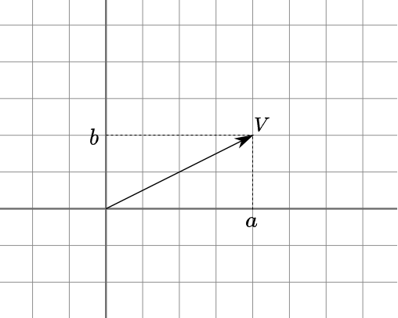
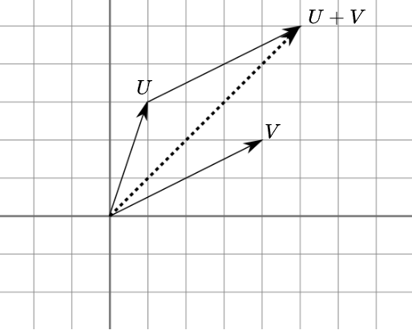
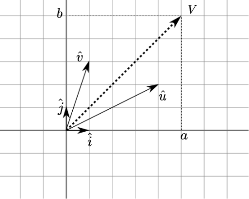
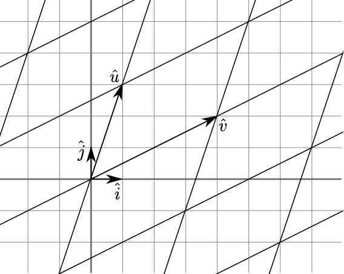
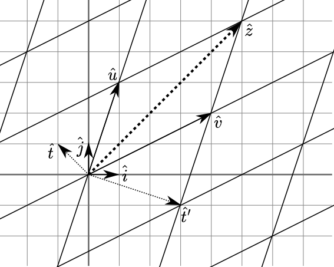
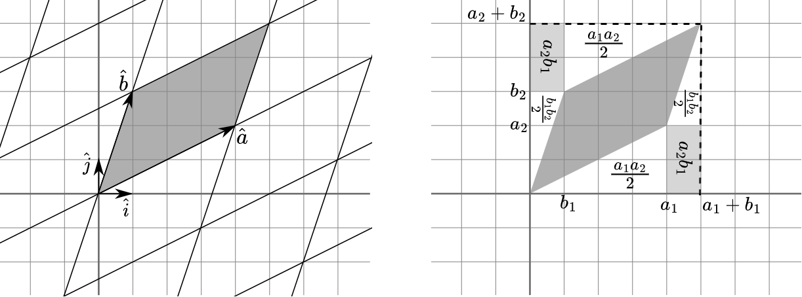
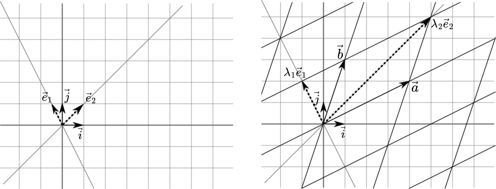

# Appendix II - Linear algebra

In this appendix we describe linear algebra, not from axioms, rather from intuitive, geometric understanding of vectors and matrices. 

Linear algebra is the study of vector spaces. For machine learning the most important vector space, is the **normed vector space**, which defines a norm, noted with $\|\cdot\|$, that simply means length.

The building blocks of vector spaces are real or integer numbers, called **scalars**, vectors and matrices.

We will build the intuition of vectors and matrices using examples in two dimensions, but all concepts equally apply for higher dimensions as well, visualizing concepts above two or three dimensions are extremely challenging and not too helpful.

## **Vectors**

There are many interpretations of vectors depending on the field of science. For vector spaces the simplest interpretation of an $n$ dimensional vector, is an $n$ dimensional arrow, having a tail always at the origin, and pointing to a coordinate defined by the $n$ scalars.

Vectors are usually noted with an arrow above a lowercase letter (e.g $\vec{v}$) or with an uppercase letter (e.g $V$). A vector can also be represented as an ordered list of it's $n$ components, usually written as a column:

$$V = \begin{pmatrix} v_1 \\ v_2 \\ \vdots \\ v_n \end{pmatrix}$$

$n$ is also called the dimensions of the vector. The set of all $n$ dimensional vectors of real numbers is noted with $\R^n$.

A special vector, of size $0$, starting and ending in the origin has all elements as $0$.

$$O = \begin{pmatrix} 0 \\ 0 \\ \vdots \\ 0 \end{pmatrix}$$

Figure II.1 shows an example of a two dimensional vector $\begin{pmatrix} a \\ b\end{pmatrix}$, where $a, b \in \R$. An intuition about vectors is that they represent movement, similar to the interpretation in physics.

 <b>Figure II.1: </b>A two dimensional vector, having tail at origin (0, 0) and pointing to (a, b), where a and b are real numbers. Normed vector spaces define length, noted with a grayed grid as the unit steps on the space

Addition of two arrays is defined as pairwise addition of it's elements

$$U+V = \begin{pmatrix} u_1 \\ u_2 \\ \vdots \\ u_n \end{pmatrix} + \begin{pmatrix} v_1 \\ v_2 \\ \vdots \\ v_n \end{pmatrix} = \begin{pmatrix} u_1 + v_1 \\ u_2 + v_2 \\ \vdots \\ u_n + v_n \end{pmatrix}$$

In figure Figure II.2 we illustrate the geometric interpretation of the vector addition. If we continue our interpretation of vectors as movement, the sum of the two movement can be considered as continuing the second movement where the first ended. To represent this visually, we can move the tail of one vector to the arrow head of the other (this is the only exception when we move a vector's tail from origin). The resulting point of the second vector tip is the sum of the two vectors. 

 <b>Figure II.2: </b>Addition of two vectors U and V

Multiplication of a vector with a scalar is defined as multiplying each element of the vector with the scalar:

$$c \cdot V = c \cdot \begin{pmatrix} v_1 \\ v_2 \\ \vdots \\ v_n \end{pmatrix} = \begin{pmatrix} c \cdot v_1 \\ c \cdot v_2 \\ \vdots \\ c \cdot  v_n \end{pmatrix}$$

This will change the scale (or norm) of the vector but not the direction of the line the vector is on. We can say the scalar scales the vector, hance the name. A negative value will flip the vector to opposite direction (on the same line), a value between $(1, +\infty)$ will enlarge it, a scalar of $1$ is a unit operation and a value in the interval $(0, 1)$ will decrease the scale of the vector.

Scaling and addition of multiple vectors is called the **linear combination** of vectors.

$$V = c_1 V_1 + ... + c_k V_k$$

### **Norm of vector**

In normed vector spaces each vector has a norm, which corresponds to length in every day language. Norm is different from the dimensions. We define norm as

$$\|V\| = \sqrt {v_1^2 + v_2^2 + ... + v_n^2}$$

### **Dot product and orthogonal vectors**

The dot product of two vectors of same dimensions $n$ is defined as the sum of pairwise products of their elements.

$$U \cdot V = u_1 v_1 + u_2 v_2 + ... + u_n v_n$$

The dot product is defined to result in $0$ if $U$ and $V$ make a $90 \degree$ angle, i.e $U$ and $V$ are perpendicular vectors. Another word with same meaning is **orthogonal** vector. Note that for the above equation to be mathematically correct $U$ needs to be a single column vector and $V$ written as a single row. This will align with concepts discussed below like matrix multiplication and transpose. 

### **Basis and span**

A set of $n$ vectors, each with $n$ dimensions, noted with $B$, with elements $\hat{b}_1, ..., \hat{b}_n$ are **linearly independent** if none of the vectors can be expressed as a linear combination of the other vectors using non zero scalars. Which means if $\hat{b}_1, ..., \hat{b}_n$ are linearly independent, the expression

$$c_1\hat{b}_1 + ... + c_n \hat{b}_n = 0$$

can be true only if scalars $c_1, ..., c_n$ are all $0$. We could visualize this by imagining that each vector points toward a different dimension.

Given a vector space $S$ with $n$ dimensions, we define the **basis** of $S$ as a set of vectors $B$ with $n$ linearly independent vectors $\hat{b}_1, ..., \hat{b}_n$. Any vector in the vector space can be expressed as a linear combination using the basis vectors: $\forall\ V, V \in S$, we can choose $n$ scalars $c_1, ..., c_n$ such that

$$V = c_1\hat{b}_1 + ... + c_n\hat{b}_n$$

A very common basis vector, also called the **standard basis vector** is a vector where each element is $0$ except for a single dimension it expands with a value of $1$.

In Figure II.3 we have a two dimensional vector space (a plane) noted by a grey grid. The standard basis vectors are $\hat{i} = \begin{pmatrix} 1 \\ 0 \end{pmatrix}$ and $\hat{j} = \begin{pmatrix} 0 \\ 1 \end{pmatrix}$, making the standard basis $B = \{\hat{i}, \hat{j}\}$. 

 <b>Figure II.3: </b>Bases of a vector space

We can express $V = \begin{pmatrix} a \\ b \end{pmatrix}$ as:

$$V = a \hat{i} + b \hat{j}$$

We scale each base vector and add the result to get any vector in the vector space. We can imagine that the base of a vector space are a set of vectors, that fills out the space trough scaling and additions (i.e linear combinations). T

he vector $V$ in Figure II.3 and any other vector of this vector space, can be also expressed trough a linear combination of $\hat{u}$ and $\hat{v}$. We can say that the set of vectors $\{\hat{u}$, $\hat{v}\}$ is also a basis for this vector space, but the coordinates of $V$ would be $\begin{pmatrix} 1 \\ 1 \end{pmatrix}$ instead of $\begin{pmatrix} a \\ b \end{pmatrix}$, because $V = 1 \cdot \hat{u} + 1 \cdot \hat{v}$.

**Span** of a set of vectors with same dimensions $n$ is the vector space that can be covered trough the linear combination of the vectors. As we have seen, if all the vectors are linearly independent, they will constitute the basis of an $n$ dimensional vector space. If only $p$ vectors are linearly independent and the rest of $n - p$ vectors can be expressed as linear combination of the other vectors, the span will be a $p$ dimensional vector space. Two vectors $\hat{a}$ and $\hat{b}$ in three dimensions might span a plane if they are linearly independent, a line if they are linearly dependent ($\hat{a} = c \cdot \hat{b}$ for some scalar $c$) or the span might be the point of origin if $\hat{a} = \hat{b} = \begin{pmatrix} 0 \\ 0 \\ 0 \end{pmatrix}$

## **Matrices**

The most important operation in linear algebra are linear transformations. Linear transformation is a way to change all vectors of a vector space according to a linear operator. Transformations on a vector space can be non linear as well, where we can bend or apply some wave to the space, but linear transformation have two properties

* Linear transformation does not change the origin of space
* Any line in the original space retains it's shape as line in the transformed shape (there is no bending) 

With these constraints the mathematics of linear transformations are more simple, and faster to compute, but still very useful. To apply linear transformation matrices are used. A matrix $M_{n,m}$ is a two dimensional structure, noted as a grid

$$M_{n,m} =  \begin{pmatrix}
  x_{1,1} & x_{1,2} & \cdots & x_{1,p} \\
  x_{2,1} & x_{2,2} & \cdots & x_{2,p} \\
  \vdots  & \vdots  & \ddots & \vdots  \\
  x_{n,1} & x_{n,2} & \cdots & x_{n,p} 
 \end{pmatrix}$$

Where $x_{1...n,1...m}$ are real numbers. The set of all matrices of size $n \cdot m$ containing real numbers is noted with $\R^{n \cdot m}$.

### **Square matrix**

To understand the structure of transformation matrix, let's start with a certain type of matrix, where the number of rows and columns are equal, called **square matrix**, which we can note $M_{n, n}$. Such a matrix describes the linear transformation in an $n$ dimensional vector space with both input and output vectors having $n$ dimensions. 

Linear transformation is interpreted as transforming any or all vector of a vector space. To see the effect of transforming the $k$ th dimension, we can take the $k$ th standard basis vector, where each element is $0$ except for the $k$ th element, which is 1, and calculate where it would be in the transformed space.

$$\vec i_k = \begin{pmatrix} 0 \\ \vdots \\ 0 \\ 1 \\ 0 \\  \vdots \\ 0 \end{pmatrix} \rightarrow \vec b_k = \begin{pmatrix} b_{k,1} \\ \vdots \\ b_{k,k-1} \\ b_{k,k} \\ b_{k,k+1} \\ \vdots \\ b_{k,n} \end{pmatrix} $$

We can imagine that each column of a matrix is a vector, the matrix $M_{n, n}$ has $n$ vectors, each of $n$ dimensions. The transformation matrix is simply the matrix constructed by conbining all the transformed basis vectors we would get applying the linear transformation to each of the original standard basis vectors.

$$I_{n, n} = \begin{pmatrix}
  1 & 0 & \cdots & 0 \\
  0 & 1 & \cdots & 0 \\
  \vdots  & \vdots  & \ddots & \vdots  \\
  0 & 0 & \cdots & 1 
 \end{pmatrix} \rightarrow M_{m,n} = \begin{pmatrix}
  b_{1,1} & b_{1,2} & \cdots & b_{1,n} \\
  b_{2,1} & b_{2,2} & \cdots & b_{2,n} \\
  \vdots  & \vdots  & \ddots & \vdots  \\
  b_{n,1} & b_{n,2} & \cdots & b_{n,n} 
 \end{pmatrix} \tag{II.1}$$

To calculate the linear transformation of a vector we use the transformation matrix and we apply an operation called matrix-vector multiplication defined as:

$$V_t = M_{n,n} \cdot V \\ = \begin{pmatrix}
  x_{1,1} & x_{1,2} & \cdots & x_{1,n} \\
  x_{2,1} & x_{2,2} & \cdots & x_{2,n} \\
  \vdots  & \vdots  & \ddots & \vdots  \\
  x_{n,1} & x_{n,2} & \cdots & x_{n,n} 
 \end{pmatrix} \begin{pmatrix} v_1 \\ v_2 \\ \vdots \\ v_n \end{pmatrix} \\ = v_1\begin{pmatrix}
  x_{1,1} \\ x_{2,1} \\ \vdots \\ x_{n,1} \end{pmatrix} + v_2\begin{pmatrix}
  x_{1,2} \\ x_{2,2} \\ \vdots \\ x_{n,2} \end{pmatrix} + ... + v_n\begin{pmatrix}
  x_{1,n} \\ x_{2,n} \\ \vdots \\ x_{n,n} \end{pmatrix} \\ = \begin{pmatrix}
  x_{1,1} v_1 + x_{1,2} v_2 + \cdots + x_{1,n} v_n  \\
  x_{2,1} v_1 + x_{2,2} v_2 + \cdots + x_{2,n} v_n  \\
  \vdots \\
  x_{n,1} v_1 + x_{n,2} v_2 + \cdots + x_{n,n} v_n  \\ 
 \end{pmatrix} \tag{II.2}$$

The resulting vector $V_t$ is also $n$ dimensional. The matrix $I_{n, n}$ in Figure II.1 is called the identity matrix. If we use this matrix as a transformation operator for a vector $V$, it would result in the same vector $I_{n,n} \cdot V = V$.

 <b>Figure II.4: </b>Vector space transformation

In Figure II.4 we can see the visual representation of a two dimensional vector space transformation. The standard base of the original space is $\{\vec i, \vec j\}$ and it's shown as a gray grid. The transformed space has standard base $\{\vec u, \vec v\}$, these vectors correspond to $\vec i$ and $\vec j$ in the original vector space. We can imagine that the space is stretched so that $\vec i$ and $\vec j$ are moved to the place of $\vec u$ and $\vec v$.

$$\vec i \rightarrow \vec u, \vec j \rightarrow \vec v$$

In Figure II.4 the transformed space can be seen as an elongated diagonally skewed grid of black lines. This transformation is described by a $2 \cdot 2$ matrix, having first column the elements of vector $u$ and second columns with elements of vector $v$.

$$M_{uv} = \begin{pmatrix}
  u_{1} & v_{1} \\
  u_{2} & v_{2} 
 \end{pmatrix}$$

If we apply the matrix-vector multiplication in the Formula II.2 to the matrix $M_{2,2}$ and $\vec i$, we get $\vec u$:

$$M_{uv} \cdot \vec i = \begin{pmatrix}
  u_{1} & v_{1} \\
  u_{2} & v_{2} 
 \end{pmatrix} \begin{pmatrix} 1 \\ 0 \end{pmatrix} = 
 \begin{pmatrix} 1 \cdot u_{1} + 0 \cdot v_{1} \\ 1 \cdot u_{2} + 0 \cdot v_{2} \end{pmatrix} = \vec u$$

Similarly we can show that $\vec j \rightarrow \vec v$. $M_{2,2}$ similarly transforms all vectors in the space. 

 <b>Figure II.5: </b>The transformation applied to a vector

Figure II.5 shows the effect of applying the linear transformation of our example matrix $M_{uv}$ on vector $\vec t$, resulting in vector $\vec t'$. We can see that the vector space was not only elongated but also flipped around the axis of vector $\vec z$

### **Determinant**

A transformation might expand or condense the vector space. The **determinant** of a matrix measures the rate of expansion applied to a vector space by the matrix. 

The standard basis vectors (what we noted with $\vec i_k, k = 1..n$) define a $1 \times 1 \times ... \times 1$ hypercube, where each standard basis vector would be an edge of the cube around the corner where the origin $O$ is. If we apply the linear transformation defined by the matrix to this cube, we get a shape called **parallelotope** (parallelogram in 2D, parallelepiped in 3D). The determinant is the area of the resulting shape after applying the matrix transformation. The determinant will be the same if we apply the transformation to any $n$ dimensional hypercube in the vector space. Any shape that can be approximated with such hypercubes will also scale with the same factor. The determinant is only defined for square matrices.

The determinant can have the following meaning depending on it's value:
* Determinant of $1$ means there is no change in the area of hypercube when applying the matrix transformation. This is the case for example for rotation and **sheer** operation.
* A determinant of $0$ of a matrix means the area of the hypercube is scaled down to $0$ with the matrix transformation. This is called **projection**, we reduce one or more dimension by projecting all points of our hyperspace to a lower dimension hyperplane or all the way down the point of origin. This also means that some or all vectors from the matrix columns are linearly dependent, based on how many dimensions we reduce. 

    The number of linearly independent columns (taken as vectors) in a square matrix is called the **rank** of the matrix. Rank is also the number of dimensions of the hyperplane resulting when applying the matrix transformation to our vector space. If the rank is equal to the number of columns, the determinant is not $0$.

    In the case of a projection a line or a hyperplane or the entire hyperspace will be projected to the point of origin $O$. The line, plane or hyperspace that ends up as the origin after the transformation is called the **kernel** or **null space** of the matrix. Mathematically the kernel is defined as the set of all vectors that become null vectors after the matrix transformation

    $$N(M)=\{v∣M \vec v=\vec 0\} \tag{II.3}$$
* The determinant will be negative for one or any odd number of flips in the hyperspace. An even number of flips restores the space to it's original "side", the same transformation can be achieved trough rotation. The absolute value of a negative determinant will tell the factor the space is being scaled.

The computation itself for the determinant is more complex for each added dimension, but here we will explore the two dimensional case and it's computation.

 <b>Figure II.6: </b>Determinant of a matrix

In Figure II.6 we can see two vectors of $\vec a = \begin{pmatrix} a_1 \\ a_2 \end{pmatrix}$ and $\vec b = \begin{pmatrix} b_1 \\ b_2 \end{pmatrix}$. They can form the transformation matrix $M_{ab} =  \begin{pmatrix}
  a_{1} & b_{1} \\
  a_{2} & b_{2} 
 \end{pmatrix}$. If we apply $M$ as the transformation matrix to the basis $\{\vec i, \vec j\}$ we get the new basis $\{\vec a, \vec b\}$. The area of the $1 \times 1$ square resting on the $\{\vec i, \vec j\}$ becomes the shaded area resting on $\{\vec a, \vec b\}$. The determinant of the matrix $M$ is the resulting area:

 $$\det(M_{ab}) = \det\begin{pmatrix}
  a_{1} & b_{1} \\
  a_{2} & b_{2} 
 \end{pmatrix} = a_1b_2 - b_1a_2$$

This can be derived looking at the right side of Figure II.6:

$\det(M_{ab}) = (a_1 + b_1)(a_2 + b_2) - 2 {a_1a_2 \over 2}  - 2 {b_1b_2 \over 2} - 2 a_2 b_1$  
$= a_1a_2 + a_1b_2 + a_2b_1 + b_1b_2 - a_1a_2 - b_1b_2 - 2 a_2 b_1$  
$= a_1b_2 - a_2b_1$

If we create another matrix with the columns flipped $M_{ba} = \begin{pmatrix}
  b_{1} & a_{1} \\
  b_{2} & a_{2} 
 \end{pmatrix}$ this would not only scale the vector space but also flip as we have seen in the case of $M_{uv}$ flipping the space around $\vec z$, on Figure II.5. In this case the determinant is negative, but absolute value remains the same: 
 
 $$\det(M_{ab}) = -\det(M_{ba})$$

### **Special transformations with square matrices**

Depending on the type of transformation we can define some special matrices

* **Identity matrix** $I_{n,n}$ has values of $1$ on it's diagonal and $0$ on every other, off-diagonal element. We have seen that this matrix preserves all vectors without any transformation.

* **Scalar matrix** has values of $k$ on it's diagonal and $0$ on every other, off-diagonal element. We can express a scalar matrix as $kI_{n,n}$. What this matrix does is scales the vector space by a scale of $k$. For values $k > 1$ the vector space is expanded, for values in the interval $(0, 1)$, the space is shrunk, for negative values of $k$ the space is mirrored around the origin and scaled by a factor of $k$. 

* **Scaling along a single dimension** can be done with a matrix where all elements are same as the identity matrix, but a single element on the diagonal has a scaler value of $k$. This matrix will preserve sizer on all dimension except for the modified dimension, where a scale by $k$ will be applied. Setting a diagonal element to $-1$ will mirror around that dimension.

* **Shear operation** is a matrix which is same as an identity matrix, except a single off-diagonal element, which is a non zero $k$ real number. For example in two dimensions a sheer matrix $S = \begin{pmatrix}
  1 & k \\
  0 & 1 
 \end{pmatrix}$. Shear matrices have a determinant of $1$

* **Orthogonal matrix** is a matrix whose vectors fulfill two conditions:
    * each vector in the matrix (column) has a norm of 1
    * all vectors in the matrix are orthogonal to each other (dot product between any two columns are $0$)

   This means each vector has size $1$ and perpendicular to all the other vectors. The identity matrix $I_{n,n}$ and any other matrix which is a rotation or mirroring in $n$ dimensions of the identity matrix are orthogonal. Applying this matrix as a transformation will result in rotation or mirroring or a combination of both.

* **Proper orthogonal matrix** adds one more condition to orthogonal matrix, that the angles of vectors are preserved. This can be verified by a determinant of $1$. Proper orthogonal matrix will apply a rotation around the origin to the vector space without mirroring. As we have mentioned, mirroring even number of times results in a transformation which is same as a rotation.

These transformation can be applied to images as well, where we can calculate the position of each pixel in a resulting image and apply interpolation or smoothing to fill in the gaps. An exception might be rotation, which is mostly done using a system called **quaternions**. Rotation with matrices suffer from a limitation called gimbal locks, where angles can align and lose degrees of freedom. Combined with limited precision of float representation of numbers, results in highly unstable motion. Quaternions use a four dimensional unit hyper-sphere to describe rotation in three dimensions.

### **Nonsquare matrices**

A square matrix with $n$ rows and $n$ columns applies a transformation in an $n$ dimensional vector space. A matrix with $n$ columns and $m$ rows makes a transformation from an $n$ to an $m$ dimensional space. The input is an $n$ dimensional vector and the output is an $m$ dimensional vector.

When $m < n$, it's called a projection. When $m > n$ the result is higher dimension, but because matrices describe linear transformation, the result of the transformation remains an $n$ dimensional hyper plane in the $m$ dimensional space.

Matrix transformation is done similarly to square matrices.

$$V_m = M_{m,n} \cdot V_n \\ = \begin{pmatrix}
  x_{1,1} & x_{1,2} & \cdots & x_{1,n} \\
  x_{2,1} & x_{2,2} & \cdots & x_{2,n} \\
  \vdots  & \vdots  & \ddots & \vdots  \\
  x_{m,1} & x_{m,2} & \cdots & x_{m,n} 
 \end{pmatrix} \begin{pmatrix} v_1 \\ v_2 \\ \vdots \\ v_n \end{pmatrix} \\ = \begin{pmatrix}
  x_{1,1} v_1 + x_{1,2} v_2 + \cdots + x_{1,n} v_n  \\
  x_{2,1} v_1 + x_{2,2} v_2 + \cdots + x_{2,n} v_n  \\
  \vdots \\
  x_{m,1} v_1 + x_{m,2} v_2 + \cdots + x_{m,n} v_n  \\ 
 \end{pmatrix}$$

### **Matrix multiplication**

Matrices, which describe linear transformations in vector spaces, can be combined. We can express as a single matrix the transformation described by the matrix $B$ happening after a transformation described by the $A$. This is called **composition** of two transformations and the mathematical operation for composition is **matrix multiplication**: $B \cdot A$. When we apply a matrix as a transformation to a vector $AV$ we put the matrix on the right hand side, we can imagine that composition is $B(AV) = BAV$. We can remove the parenthesis because matrix multiplication is associative: the same transformations are being applied in the same order even if we evaluate the multiplications in different orders. This notation of inversed order come from function notations $g(f(x))$

The formula for matrix multiplication uses the formula of matrix vector multiplication (Formula II.2). Each column $k$ in the output matrix, if treated as a vector, is the $k$ th column in the right hand side matrix, also treated as a vector, transformed  (multiplied) by the left hand matrix. Summarized the product formula looks like this:

$$B \cdot A = \begin{pmatrix}
  b_{1,1} & b_{1,2} & \cdots & b_{1,m} \\
  b_{2,1} & b_{2,2} & \cdots & b_{2,m} \\
  \vdots  & \vdots  & \ddots & \vdots  \\
  b_{p,1} & b_{p,2} & \cdots & b_{p,m} 
 \end{pmatrix}\begin{pmatrix}
  a_{1,1} & a_{1,2} & \cdots & a_{1,n} \\
  a_{2,1} & a_{2,2} & \cdots & a_{2,n} \\
  \vdots  & \vdots  & \ddots & \vdots  \\
  a_{m,1} & a_{m,2} & \cdots & a_{m,n} 
 \end{pmatrix} = \\ = \begin{pmatrix}
  \sum_{i=1}^m b_{1,i}a_{i,1} & \sum_{i=1}^m b_{1,i}a_{i,2} & \cdots & \sum_{i=1}^m b_{1,i}a_{i,n} \\
  \sum_{i=1}^m b_{2,i}a_{i,1} & \sum_{i=1}^m b_{2,i}a_{i,2} & \cdots & \sum_{i=1}^m b_{2,i}a_{i,n} \\
  \vdots  & \vdots  & \ddots & \vdots  \\
  \sum_{i=1}^m b_{p,i}a_{i,1} & \sum_{i=1}^m b_{p,i}a_{i,2} & \cdots & \sum_{i=1}^m b_{p,i}a_{i,n} 
 \end{pmatrix}$$

Matrices can be multiplied only if the number of columns of the left hand matrix $m$ is equal to the number of rows to the right hand matrix: the output dimension of the first transformation has to be the same as the input dimension of the second transformation. The input dimension of the product $B \cdot A$ is the number of columns $n$ of the right hand side matrix $A$, the output dimension is the number of rows $p$ in the left hand matrix $B$.

Matrix multiplication is not commutative. For non square matrices, the input-output dimensions need to match up, but for square matrices depending on the order of transformations applied, the result might be different:

$$\exists A, B \in R^{n,n} \rightarrow B A \neq A B$$

In case of square matrices, the determinant of matrix multiplication is equal to the product of the determinants:

$$\det(B \cdot A) = \det(B) \det(A)$$

While the mathematical proof of this is difficult, the intuition behind this is that the rate of change $\det(B \cdot A)$ on the vector space described by the composite transformation $B \cdot A$ is same as the rate of change $\det(B)$ done by the matrix $B$ on the rate of change $\det(A)$ done by $A$.

### **Inverse matrices**

As matrices describe transformations, the inverse of a transformation can be described by the **inverse matrix**. We note inverse matrix of $M$ with $M^{-1}$:

$$M^{-1}M = MM^{-1} = I$$

Applying both $M$ and the inverse $M^{-1}$ is equivalent to applying the identity matrix as a transformation.

Projections don't have a defined inverse (there is loss of information, e.g the matrix might project every line to a point, so the inverse would be expanding a point to a line, which cannot be done with a linear operation, so non square matrices don't have definition of inverse matrices. Similarly we have seen that determinant of $0$ also constitutes as projection, so matrices with $\det(M) = 0$ also do not have an inverse matrix defined.

Several highly optimized algorithms have been proposed to calculate the inverse. In many cases, the inverse matrix is not even calculated, rather the operation done with the inverse matrix (e.g matrix vector multiplication) is calculated or approximated trough an iterative process. This approach saves computation as well as memory for large matrices.

### **Change of basis**

In the same way we applied a matrix as a transformation to a vector in a vector space, we can apply a matrix as a transformation to the base of the vector space as well. Transforming the vector to another basis is done the same way as applying transformation to the vector.

$$U = B \cdot V$$

where $V$ is the vector, $B$ is the transformation matrix and $U$ is the vector $V$ under the basis $B$ (it's the same equation as transforming $V$ by $B$, but different interpretation). 

In some cases transforming a vector under a specific base is more simple than in another base. A common process in linear algebra is to transform a vector to another base (noted with $B$), apply a specific transformation under the base of $B$ (noted with $M_B$), and reverse the base transformation. A transformation can be reversed using the inverse matrix $B^{-1}$:

$$U = B^{-1} \cdot M_B \cdot B \cdot V$$

In the above there are the following steps, which we can read right to left:
* Transform $V$ to another basis with $B$
* Apply matrix transformation using $M_B$
* Reverse basis transformation with $B^{-1}$

All the above steps are simple matrix multiplications.

### **Eigenvectors and eigenvalues**

The hyperline a non-zero vector rests on is the **span** of the vector. When we apply a matrix transformation to all vectors of a vector space, most vectors would change direction where they point, we say they **change their span**. This definition of span is a unique case of the definition highlighted above, applied to a single vector.

**Eigenvectors** of a matrix $M$ which do not change their span during the matrix transformation. Eigenvectors might change scale during the matrix transformation, the rate of change $\lambda$ is called the **eigenvalue** of the eigenvector. 

The mathematical relationship is defined as:

$$MV = \lambda V \tag{II.4}$$

which states that applying the matrix $M$ as a linear transformation to $V$ is same as multiplying $V$ with a scalar $\lambda$. While this equation is not true for all vectors, all non zero solutions of $V$ are the eigenvectors and corresponding result of $\lambda$ are the eigenvalues. We can rearrange the equation by introducing the identity matrix on the right side and moving everything to the left, resulting in the zero vector $\vec 0$ :

$$MV - I \lambda V = \vec 0 \\
(M- I\lambda) V = \vec 0$$

Writing the above in detail:

$$\begin{pmatrix}
  m_{1,1} - \lambda & m_{1,2} & \cdots & m_{1,n} \\
  m_{2,1} & m_{2,2} - \lambda & \cdots & m_{2,n} \\
  \vdots  & \vdots  & \ddots & \vdots  \\
  m_{n,1} & m_{n,2} & \cdots & m_{n,n} - \lambda 
 \end{pmatrix} \begin{pmatrix} v_{1} \\  v_{2} \\  \vdots\\ v_{n} \end{pmatrix}
= \begin{pmatrix} 0 \\ 0 \\  \vdots\\ 0 \end{pmatrix} $$ 

The result of $(M- I\lambda) V$, a matrix vector multiplication has to be $\vec 0$, meaning the matrix $M- I\lambda$ reduces the dimension of the vector space, which in turn is only possible if the determinant is $0$: $det(M- I\lambda) = 0$. We can use this property together with the equation of determinant to calculate the eigenvalues and eigenvectors of a matrix. A polinomial $O(n^3)$ algorithm exists for calculating the determinant which in turn is an n-th degree polynomial, having $n$ solutions for the eigenvalue $\lambda$.  Using solutions of $\lambda$ in Equation II.4 we can get eigenvectors for each eigenvalue up to a constant factor, meaning that we will not get an exact vector, only a direction. Since all vectors on the direction of an eigenvector will share the properties of preserving the span and be scaled by a constant, so they are also eigenvectors. In other words if we multiply an eigenvector $\vec e$ with a constant $c$ we get another eigenvector $\vec e'$:

$$\vec e' = c \vec e$$

Since in most cases we need a single eigenvector per direction, we can use the normalized version (length $1$), and because we still have two of these, for the case of $c = -1$, we can choose the one where the first element is always positive. 

Figure II.7 displays a two dimensional example of the eigenvector and eigenvalue. On the left side we see two vectors $\vec e_1$ and $\vec e_2$, and the lines on which the vectors rest on. The lines are the spans of the vectors. On the right side of the diagram we have two more vectors, $\vec a = \begin{pmatrix} a_1 \\ a_2 \end{pmatrix}$ and $\vec b = \begin{pmatrix} b_1 \\ b_2 \end{pmatrix}$. The vectors $\vec a$ and $\vec b$ can describe a transformation as $M = \begin{pmatrix}a_{1} & b_{1} \\ a_{2} & b_{2}\end{pmatrix}$. Applying the transformation $M$ would knock any vector off it's span in our two dimensional vector space except for vectors resting on the two highlighted lines. 

 <b>Figure II.7: </b>Eigenvectors and eigenvalues of a transformation

$\vec e_1$ and $\vec e_2$ are eigenvectors of $M$, applying $M$ as a matrix transformation to these vectors we get $\lambda_1 \vec e_1$ and $\lambda_2 \vec e_2$ respectively, meaning their span was preserved and they were scaled by the eigenvalues $\lambda_1$ and $\lambda_2$. All vectors on the highlighted spans are eigenvectors.

A special case is scaler transformation matrices (matrices that apply scaling on the vector space). When we apply a scaling matrix, all vectors of a vector space will preserve their span. In this case all vectors in the vector space are eigenvectors belonging to a single eigen value, which is the same as the scaling applied by the matrix.

Another special case is rotation. Rotation in two dimensions will knock all vectors off their span except the $\vec 0$. Since eigenvector needs to be non zero, a two dimensional rotation does not have any eigenvector. In three dimension, applying a rotation matrix, the span of the resulting eigenvector will define the axis of rotation. The corresponding eigenvalue would be $1$ since there is no scaling.

## **Matrix decomposition**

Matrix multiplication is also called composition, because we are composing multiple transformations into a single one. Given a matrix, **decomposition** of the matrix means writing a matrix in terms of the product of other matrices. The geometric interpretation is that we rewrite a linear transformation as a series of transformations, usually more simple ones. In most cases our aim is for each matrix in our decomposition to be a primitive operation like a rotation or scaling. While composition gives a single result, decomposition can be done in infinite ways.

### **Eigen decomposition**

**Eigen decomposition** decomposes a matrix into three transformation using eigenvectors usinng the formula for basis change:

* Change basis to the base defined by eigenvectors
* Apply simple scaling
* Reverse base change

Eigen decomposition can only be applied in the following conditions:

* The matrix we want to decompose is a square matrix. Only square matrices have eigenvalues
* The $n$ dimensional matrix has $n$ eigenvalues with $n$ corresponding linearly independent eigenvectors. This is required for inverse matrix part of the basis change.

We will decompose a square matrix $A$ with $e_1...e_n$ as the normalized, linearly independent eigenvectors of $A$ and $\lambda_1...\lambda_n$ as the corresponding eigenvalues. Using the formula for eigenvalues and eigenvectors we can write $n$ equations in the form:

$$Ae_1 = \lambda_1 e_1 \\ Ae_2 = \lambda_2 e_2 \\ ... \\ Ae_n = \lambda_n e_n$$

We can rewrite our $n$ equation using a single matrix equation:

$$A\begin{pmatrix}
  | & | &  & | \\
  e_1 & e_2 & \cdots & e_n \\
  | & | &  & | \\ 
 \end{pmatrix} = \begin{pmatrix}
  | & | &  & | \\
  e_1 & e_2 & \cdots & e_n \\
  | & | &  & | \\ 
 \end{pmatrix}\begin{pmatrix}
  \lambda_1 & 0 & \cdots & 0 \\
  0 & \lambda_2 & \cdots & 0 \\
  \vdots  & \vdots  & \ddots & \vdots  \\
  0 & 0 & \cdots & \lambda_n 
 \end{pmatrix}$$

To see that this is true we can apply the matrix multiplication. If we name the matrix where each column is an eigenvector with $U$ and the column matrix with eigenvalues $\Lambda$ we can rewrite the equation as: 

$$AU = U\Lambda$$

Applying $U^{-1}$ from the right to both sides we get the formula for eigen decomposition

$$A = U\Lambda U^{-1} \tag{II.5}$$

$\Lambda$ is a column matrix, which corresponds to a scaling transformation. Formula II.5 corresponds to a basis change, and applying a simple scaling in the modified basis. 

One very useful use case of eigen decomposition is calculating large powers of a matrix. We can rewrite $A^k$ as: 
$A^k = U \Lambda U^{-1} \cdot U\Lambda U^{-1}  \cdot ...  \cdot U\Lambda U^{-1}$

The $U^{-1} \cdot U$ pairs cancel out giving 
$A^k = U \Lambda^k U^{-1}$

Where $\Lambda^k$ can be calculated with much fewer operations, having the form of:

$\Lambda^k = \begin{pmatrix}
  \lambda_1^k & 0 & \cdots & 0 \\
  0 & \lambda_2^k & \cdots & 0 \\
  \vdots  & \vdots  & \ddots & \vdots  \\
  0 & 0 & \cdots & \lambda_n^k 
 \end{pmatrix}$

While $U$ and $U^{-1}$ also require computation, for high power of $k$ the eigen decompostion might be computationally less heavy, more so if results for multiple powers of $k$ are needed. Another use case is if we apply to special matrices where computing $U^{-1}$ from $U$ is straightforward.

### **Transpose of a matrix**

Before we look into other decompositions we need the definition of a new operator: **transpose of a matrix**.

While transpose of a matrix does not have a simple and intuitive geometric interpretation, the mathematical definition is quite simple. The transpose of a matrix is an operation that flips the matrix over its diagonal, switching the row and column indices. Given a matrix $A$ of dimensions $m \times n$, the transpose of $A$, denoted as $A^T$ or $A'$, is a new matrix of dimensions $n \times m$, where the element at row $i$ and column $j$ in $A$, noted with $a_{i,j}$, becomes the element at row $j$ and column $i$ in $A^T$, noted with $a^T_{j,i}$:

$$a_{i,j} = a^T_{j,i}$$

An interesting case of transpose is that of an orthogonal matrix, noted with $R$, resulting in it's inverse:

$$R^T = R^{-1} \tag{II.6}$$

An orthogonal matrix describes a rotation, the inverse matrix describes the inverse transformation. Inverse of a rotation would mean a rotation in inverse direction with same angle and axis as the original rotation. 

Proof of Formula II.6: 
$R^T = R^{-1}$ multiply from the right side with $R$ 
$R^TR = R^{-1}R$ 
$R^TR = I$ 
The matrix product is a dot product of columns of the left hand side matrix with rows of the right hand side matrix. Since $R$ is orthogonal means every column, if treated as a vector, has a norm of $1$ and is orthogonal to every other column vector, except for itself. Here, we are multiplying the orthogonal matrix with it's transpose, which means we will calculate dot products of orthogonal vectors. The dot product of two orthogonal vectors is $0$, the dot product of a unit vector with itself is $1$. This means that elements on the main diagonal would result in $1$ and elements off the main diagonal would result in $0$, giving the overall result as $I$.

We can define transpose of vectors as well, in which case it will turn a single column vector to a single row vector and vice versa. We can use it to more properly define product of perpendicular vectors as 

$$U  \cdot V^T = 0$$

where $U$ and $V$ are perpendicular vectors.

A property of transpose is that transpose of a product (of vectors and matrices) is the inverse direction of product of element wise transpose:

$$(AB)^T = B^TA^T \tag{II.7}$$

where $A$ and $B$ can be matrices or vectors of appropriate sizes to accomodate the definition of product (e.g A may be matrix and B can be a vector). 

The transpose of a scalar is simply itself:

$$c^T = c$$

### **Symmetric matrices**

A square matrix $M$ is **symmetric** if elements $m_{i,j}$  below the main diagonal ($m_{i,i}$) are equal to their corresponding pair above the main diagonal: $m_{i,j} = m_{j,i}$ (notice the change of order between $i$ and $j$). Non-square matrices cannot be symmetrical.

Symmetric matrices are very useful because they have lots of favorable properties. 

The most simple property is that the transpose of a symmetric matrix is equal to the original matrix.

$$S = S^T \iff S \operatorname{is\ symmetrical}$$

Eigenvectors of symmetric matrices also have very useful properties. Symmetric matrices of dimension $n$ have $n$ non zero eigenvalues and $n$ linearly independent eigenvectors (vectors have unique directions). The proof of this is quite complex involving further definitions we omitted so we will omit the proof of this also.

An even more interesting property which can be easily shown is that the eigenvectors of symmetric matrices are orthogonal. In other words, each eigenvector is perpendicular to all others. And since we can mirror eigenvectors on the point of origin and get a corresponding eigenvector, eigenvectors will form a proper orthogonal basis. Proper orthogonal basis is same as the basis of the vector space rotated away.

Proof: 

To prove let's consider the symmetric matrix $A$ and two linearly independent eigenectors $x$ and $y$, corresponding to different eigenvalues $\lambda_x$ and $\lambda_y$ respectively (instead of two eigenvectors of the same direction, corresponding to same eigenvalue)

Using the definition of eigenvalue and eigenvector we can input our two eigenvalues and corresponding eigenvectors to get two equations:

$Ax = \lambda_x x,\ Ay = \lambda_y y$ 
Multiplying with the transpose of the other eigenvector from the left we get 
$y^TAx = \lambda_x y^T x,\ x^TAy = \lambda_y x^Ty$ 
Taking transpose of both sides of the first equation and keeping the second one as is 
$(y^TAx)^T = (\lambda_x y^T x)^T,\ x^TAy = \lambda_y x^Ty$ 
Apply itemwise transpose instead of transpose of product 
$(x^T)^TA^Ty = \lambda_x x^T y,\ x^TAy = \lambda_y x^Ty$ 
Transpose of a transpose of a vector is same as the vector (we just turn column vector to row and back to column). Also transpose of a symmetric matrix is itself and $A$ is symmetric: 
$x^TAy = \lambda_x x^T y,\ x^TAy = \lambda_y x^Ty$ 
The left hand side of both equations are now equal, we can substract the two equations: 
$0 = (\lambda_x - \lambda_y)x^Ty$ 
And since we said that $\lambda_x \ne \lambda_y$ and the vectors $x$ and $y$ are non zero, it must be that $x^Ty = 0$ which is the definition of orthogonal vectors.

### **Spectral decomposition**

**Spectral decomposition** is the process of applying eigen decomposition to symmetric matrices using the properties discussed earlier. The eigenvectors of a symmetric matrix are orthogonal (perpendicular), and describe a new basis. We can change the basis from the symmetric matrix trough a simple rotation to the basis described by the eigenvectors. As we have seen for eigen decompostion, the transformation becomes a simple scaling under the base of eigenvectors. Writing all this mathematically we get the decomposition of a symmetric matrix $S$ as:

$$S = Q\ \Lambda\ Q^T$$

where $Q$ is an orthogonal matrix we use to change basis, but using transpose to change back, instead of inverse, because they are equal. Each column of $Q$ is a normalized eigenvector of $S$. $\Lambda$ is a diagonal matrix describing a simple scaling operation under the changed basis. The values on the diagonal of $\Lambda$ are the eigenvalues of $S$.

Spectral decomposition states that all symmetric matrices can be decomposed as a rotation, which we can calculate by finding the normalized eigenvectors, a scaling and an inverse rotation given by the transpose of the rotation.

### **Singular value decomposition (SVD)**

So far we looked into eigenvalue decomposition which could be applied to matrices with certain conditions. Than we have seen spectral decomposiotn which was a special case of eigen decomposition, applied to an even more specific matrix, the symmetric matrix. 

**Singular Value Decomposition (SVD)** is a powerful matrix decomposition technique, and the beautiful thing about it is its generality. SVD can be applied to any $m \times n$ matrix. 

While most matrices  are not symmetrical we can construct symmetric matrices for any matrix. Given an $m \times n$ matrix $A$ both $AA^T$ of size $m\times m$ and $A^TA$ of size $n \times n$ are symmetrical. This statement is very simple to prove, using the attribute that the transpose of a product is the inverse ordered product of element wise transpose (Equation II.7). Using this attribute we can show that the transpose of the product $AA^T$ is same as itself. First we apply Formula II.7 to AA^T 

$(AA^T)^T = (A^T)^TA^T$ 
And than we simplify $(A^T)^T = A$ 
$(AA^T)^T = AA^T$ 

Since the expression $AA^T$ is equal to it's transpose $(AA^T)^T$, it means $AA^T$ is symmetrical. Similarly we can show that $A^TA$ is also symmetrical. We can name $AA^T$ as $S_L$ (left) and $A^TA$ as $S_R$ (right).

$S_L$ and $S_R$, because they are product in the form of $MM^T$, are not only symmetric matrices but all eigenvalues are non negative, also called **positive semi-definite** (PSD) matrices. Furthermore if we sort eigenvalues of $S_L$ and $S_R$ in decreasing order, the largest eigenvalue of both matrices will be equal, the second largest eigenvalue of both will be also equal, etc. Since $S_L$ and $S_R$ might have different dimensions, the remaining eigen values will all be $0$. For example if $m < n$ for $S_L$ of size $m \times m$ and $S_R$ of size $n \times n$, for the ordered eigen values $\lambda_{SL1},...,\lambda_{SLm}$ of $S_L$ and $\lambda_{SR1},...,\lambda_{SRn}$ of $S_R$

$$\lambda_{SL1} = \lambda_{SR1}, \lambda_{SL2} = \lambda_{SR2}, ... , \lambda_{SLm} = \lambda_{SRm}$$

The left over eigenvalues of $S_R$ are equal to $0$:

$$\lambda_{SRm+1} = 0, ..., \lambda_{SRn} = 0$$

This is the case where $m < n$, if $m > n$, $S_L$ will have left over eigenvalues all equal to $0$ instead. While proof of these statements can be shown trough simple matrix operations we will omit for simplicity.

The square root of the shared eigenvalues of $S_L$ and $S_R$ are called the **singular values**. The $k$ th singular value is

$$\sigma_k = \sqrt{\lambda_{SLk}} = \sqrt{\lambda_{SRk}}$$

where $k = 1,  ..., \min(m, n)$

We can calculate the eigenvectors of both $S_L$ and $S_R$ which are known as left singular singular vectors and right singular vectors respectively. Ordering the vectors in decreasing order according to their eigenvalues, we can construct two matrices. We can notate matrix having the eigenvectors of $S_L$ as columns with $U$, and the matrix having the eigenvectors of $S_R$ as columns as $V$.

After all the definitions we can finally write our SVD decomposition. Specifically, using the $m \times n$ matrix $A$, there always exists a decomposition of the form:

$$A=U\Sigma V^T$$

Where:

* $U$ and $V$ are the orthogonal matrices we calculated using the ordered eigenvectors of $S_L$ and $S_R$
* $\Sigma$ is an $m \times n$ diagonal matrix (same size as $A$) with the singular values on the diagonal arranged in decreasing order. 

Similar to spectral decomposition, SVD decomposes the matrix into a rotation, a scaling and an inverse rotation. As opposed to spectral decomposition, the scaling might remove or add dimension to our transformation, and the rotation on the left and right might happen in different number of dimensions, according to the number of rows and columns of $A$.

SVD has a large number of applications in data science like principal component analysis, which is a dimensionality reduction technique, data compression, recommendation systems, natural language processing, etc. From the perspective of the decomposition, the order of eigenvalues does not matter as long we preserve the same order for eigenvectors and apply special care for the zero singular values. The reason we sorted eigenvalues in decreasing order, is because each singular value signifies the amount of stretching or compression that the matrix induces along a particular orthogonal direction in the input space. We usually care more for the larger changes. Similarly how we round off some digits in a large number, we can remove less significant singular values, allowing for use cases like compression and dimensionality reduction.